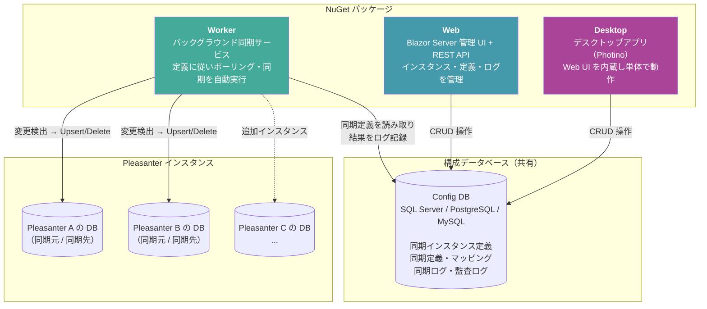

# VehicleVision.Pleasanter.ReplicaSync

<!-- markdownlint-disable MD013 -->

[](https://dotnet.microsoft.com/) [](https://pleasanter.org/) [](LICENSE) [](https://www.nuget.org/packages/VehicleVision.Pleasanter.ReplicaSync.Worker) [](https://www.nuget.org/packages/VehicleVision.Pleasanter.ReplicaSync.Web) [](https://www.nuget.org/packages/VehicleVision.Pleasanter.ReplicaSync.Desktop)

<!-- markdownlint-enable MD013 -->

複数の Pleasanter インスタンス間でデータを同期するためのレプリカ同期プラットフォームです。
Hub-Spoke / Peer-to-Peer トポロジ、複数の競合解決戦略、マルチDBMS（SQL Server / PostgreSQL / MySQL）をサポートします。

<!-- START doctoc generated TOC please keep comment here to allow auto update -->
<!-- DON'T EDIT THIS SECTION, INSTEAD RE-RUN doctoc TO UPDATE -->

- [VehicleVision.Pleasanter.ReplicaSync](#vehiclevisionpleasanterreplicasync)
    - [主な機能](#主な機能)
    - [クイックスタート](#クイックスタート)
        - [前提条件](#前提条件)
        - [インストール](#インストール)
        - [設定](#設定)
        - [起動](#起動)
    - [ドキュメント](#ドキュメント)
    - [NuGet パッケージ](#nuget-パッケージ)
    - [サードパーティライセンス](#サードパーティライセンス)
    - [セキュリティ](#セキュリティ)
    - [開発に参加する](#開発に参加する)
    - [謝辞](#謝辞)

<!-- END doctoc generated TOC please keep comment here to allow auto update -->

## 主な機能

- **マルチトポロジ対応** - Hub-Spoke（親子）および Peer-to-Peer トポロジをサポート
- **競合解決戦略** - SourceWins / LastWriteWins / ManualResolution / FieldLevelMerge の4つの戦略から選択
- **カラムレベル制御** - 同期対象カラムの Include / Exclude フィルタリング
- **マルチDBMS** - SQL Server、PostgreSQL、MySQL の Pleasanter インスタンスおよび構成データベースに対応
- **同期キー** - 任意のカラムをキーとしたレコードマッチング
- **削除同期** - ソフトデリート追跡による削除レコードの同期
- **バージョン履歴** - 上書き前のレコード状態をスナップショットとして自動保存
- **監査ログ** - すべての同期操作を詳細に記録
- **Web UI** - Blazor Server ベースの管理画面でインスタンス・定義・ログを管理
- **Web API** - API キー認証による REST API で外部システムとの連携が可能
- **バックグラウンドサービス** - .NET Worker Service による継続的なポーリング同期
- **デスクトップアプリ** - Photino ベースのクロスプラットフォーム対応デスクトップクライアント（Windows / Linux / macOS）

## システム構成

<!-- markdownlint-disable MD013 -->



<!-- markdownlint-enable MD013 -->

| パッケージ    | 役割                                                                 |
| ------------- | -------------------------------------------------------------------- |
| **Worker**    | 同期エンジン本体。構成 DB の定義に従い Pleasanter DB 間でデータ同期  |
| **Web**       | 管理画面・API。同期インスタンスや定義の登録、ログ確認を行う          |
| **Desktop**   | Web UI を内蔵したデスクトップアプリ。サーバ不要で単体起動可能        |

> Worker と Web（または Desktop）は**同じ構成データベース**を参照します。
> Web / Desktop で定義を作成し、Worker が自動的にその定義を読み取って同期を実行します。

## クイックスタート

### 前提条件

- [.NET 10 ランタイム](https://dotnet.microsoft.com/download)（ASP.NET Core Runtime 含む）
- SQL Server / PostgreSQL / MySQL のいずれか（構成データベース用）
- 同期対象の Pleasanter インスタンスのデータベースへの接続

### インストール

NuGet パッケージを使用して、最も簡単にセットアップできます。

```bash
# Worker サービス（同期実行）
cd ..
dotnet new worker -n ReplicaSyncWorker
cd ReplicaSyncWorker
dotnet add package VehicleVision.Pleasanter.ReplicaSync.Worker

# Web UI（管理画面）
dotnet new web -n ReplicaSyncWeb
cd ReplicaSyncWeb
dotnet add package VehicleVision.Pleasanter.ReplicaSync.Web

# Desktop アプリ（サーバ不要・クロスプラットフォーム）
cd ..
dotnet new console -n ReplicaSyncDesktop
cd ReplicaSyncDesktop
dotnet add package VehicleVision.Pleasanter.ReplicaSync.Desktop
```

デスクトップアプリの詳細なセットアップ手順は[デスクトップアプリ インストールガイド](docs/wiki/installation-desktop.md)を参照してください。

詳細な手順は[インストールガイド](docs/wiki/Home.md#インストールガイド)を参照してください。

### 設定

構成データベース（空のデータベース）を事前に作成します。テーブルはアプリケーション起動時に自動作成されます。

```sql
-- SQL Server の例
CREATE DATABASE ReplicaSync;
```

Web UI・Worker **両方**の `appsettings.json` で、同じ構成データベースの接続先を設定します。

```json
{
    "ConnectionStrings": {
        "ConfigDatabase": "<構成データベースの接続文字列>"
    },
    "ConfigDatabaseType": "SqlServer"
}
```

`ConfigDatabaseType` には `SqlServer`、`PostgreSql`、`MySql` を指定できます。
詳細は[設定ガイド](docs/wiki/configuration-guide.md)を参照してください。

### 起動

インストール先のルートディレクトリ（`ReplicaSyncWeb` / `ReplicaSyncWorker` の親ディレクトリ）で実行します。

```bash
# Web UI を起動（ブラウザで管理画面にアクセス）
dotnet run --project ReplicaSyncWeb

# Worker サービスを起動（別ターミナルでバックグラウンド同期を実行）
dotnet run --project ReplicaSyncWorker
```

Web UI（既定: `http://localhost:5000`）にアクセスし、初期管理者アカウントでログインします。

| 項目       | 既定値          |
| ---------- | --------------- |
| ユーザー名 | `administrator` |
| パスワード | `vehiclevision` |

> **重要**: 初回ログイン時にパスワードの変更が求められます。必ず安全なパスワードに変更してください。

ダッシュボードから、以下の操作が可能です：

- 同期インスタンスの登録・編集・削除
- 同期定義の作成・有効化・無効化
- 同期ログの確認
- ユーザー管理（管理者のみ）

操作方法の詳細は [Web UI 取扱説明書](docs/wiki/web-manual.md)を参照してください。

## ドキュメント

詳細なドキュメントは [Wiki](docs/wiki/Home.md) にまとめています。

<!-- markdownlint-disable MD013 MD060 -->

| カテゴリ     | ドキュメント                                                                                                                                                                                                                      |
| ------------ | --------------------------------------------------------------------------------------------------------------------------------------------------------------------------------------------------------------------------------- |
| インストール | [NuGet](docs/wiki/installation-nuget.md) / [デスクトップ](docs/wiki/installation-desktop.md) / [Azure](docs/wiki/installation-azure.md) / [Windows](docs/wiki/installation-windows.md) / [Linux](docs/wiki/installation-linux.md) |
| 設定         | [設定ガイド](docs/wiki/configuration-guide.md)                                                                                                                                                                                    |
| 操作方法     | [Web UI 取扱説明書](docs/wiki/web-manual.md)                                                                                                                                                                                      |
| API          | [Web API リファレンス](docs/wiki/web-api-reference.md)                                                                                                                                                                            |

<!-- markdownlint-enable MD013 MD060 -->

## NuGet パッケージ

<!-- markdownlint-disable MD013 -->

| パッケージ                                                                                                                  | 説明                                               |
| --------------------------------------------------------------------------------------------------------------------------- | -------------------------------------------------- |
| [VehicleVision.Pleasanter.ReplicaSync.Worker](https://www.nuget.org/packages/VehicleVision.Pleasanter.ReplicaSync.Worker)   | バックグラウンド同期 Worker サービス               |
| [VehicleVision.Pleasanter.ReplicaSync.Web](https://www.nuget.org/packages/VehicleVision.Pleasanter.ReplicaSync.Web)         | Blazor Server ベースの管理 Web UI                  |
| [VehicleVision.Pleasanter.ReplicaSync.Desktop](https://www.nuget.org/packages/VehicleVision.Pleasanter.ReplicaSync.Desktop) | クロスプラットフォーム対応デスクトップクライアント |

<!-- markdownlint-enable MD013 -->

```bash
dotnet add package VehicleVision.Pleasanter.ReplicaSync.Worker
dotnet add package VehicleVision.Pleasanter.ReplicaSync.Web
dotnet add package VehicleVision.Pleasanter.ReplicaSync.Desktop
```

## サードパーティライセンス

このプロジェクトは以下のサードパーティライブラリを使用しています：

<!-- markdownlint-disable MD013 -->

| ライブラリ                              | ライセンス   | 用途                            |
| --------------------------------------- | ------------ | ------------------------------- |
| Microsoft.EntityFrameworkCore           | MIT          | ORM / 構成データベースアクセス  |
| Microsoft.EntityFrameworkCore.SqlServer | MIT          | SQL Server プロバイダー         |
| Microsoft.Extensions.Hosting            | MIT          | Worker サービスホスティング     |
| Microsoft.Extensions.Logging            | MIT          | ログ抽象化                      |
| NLog                                    | BSD-3-Clause | ロギングフレームワーク          |
| NLog.Extensions.Hosting                 | BSD-3-Clause | NLog の .NET Host 統合          |
| NLog.Web.AspNetCore                     | BSD-3-Clause | NLog の ASP.NET Core 統合       |
| Microsoft.Data.SqlClient                | MIT          | SQL Server ADO.NET ドライバー   |
| Npgsql                                  | PostgreSQL   | PostgreSQL ADO.NET ドライバー   |
| Npgsql.EntityFrameworkCore.PostgreSQL   | PostgreSQL   | PostgreSQL EF Core プロバイダー |
| MySqlConnector                          | MIT          | MySQL ADO.NET ドライバー        |
| Microting.EntityFrameworkCore.MySql     | MIT          | MySQL EF Core プロバイダー      |
| Photino.NET                             | MIT          | クロスプラットフォーム WebView  |

<!-- markdownlint-enable MD013 -->

ライセンスファイルの全文は [LICENSES](./LICENSES/) フォルダを参照してください。

## セキュリティ

セキュリティ上の脆弱性を発見された場合は、[セキュリティポリシー](.github/SECURITY.md)をご確認の上、ご報告ください。

## 開発に参加する

プロジェクトへの貢献を歓迎します。バグ報告、機能要望、プルリクエストについては[コントリビューションガイド](CONTRIBUTING.md)をご覧ください。

## 謝辞

セキュリティ脆弱性の報告やプロジェクトへの貢献をしてくださった方々に感謝いたします。

<!-- 貢献者・報告者はこちらに追記 -->
