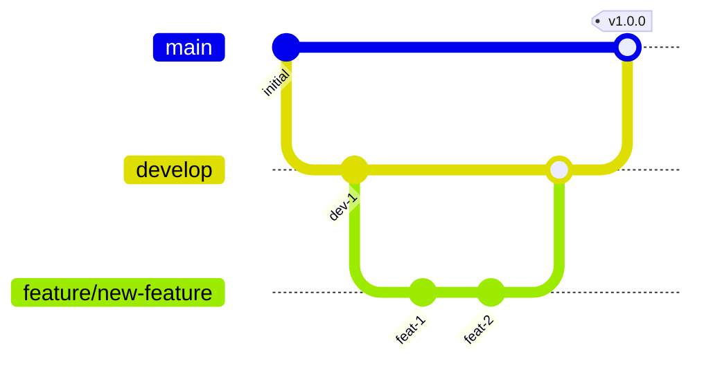
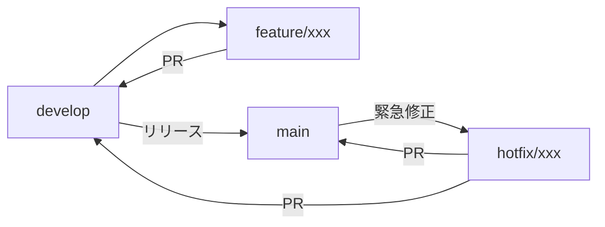

# ブランチ戦略とリリース手順

このドキュメントでは、本リポジトリのブランチ戦略とリリース手順について説明します。

本プロジェクトでは **GitFlow** をベースとしたブランチ戦略を採用しています。

<!-- START doctoc generated TOC please keep comment here to allow auto update -->
<!-- DON'T EDIT THIS SECTION, INSTEAD RE-RUN doctoc TO UPDATE -->

- [GitFlow 概要](#gitflow-概要)
- [ブランチ構成](#ブランチ構成)
    - [メインブランチ](#メインブランチ)
    - [作業ブランチ](#作業ブランチ)
- [ブランチの流れ](#ブランチの流れ)
- [ブランチ命名規則](#ブランチ命名規則)
    - [ルール](#ルール)
- [開発フロー](#開発フロー)
- [リリース手順](#リリース手順)
- [Hotfix フロー](#hotfix-フロー)

<!-- END doctoc generated TOC please keep comment here to allow auto update -->

---

## GitFlow 概要

---

## ブランチ構成

### メインブランチ

| ブランチ  | 用途                                         |
| --------- | -------------------------------------------- |
| `main`    | 安定版リリース。タグ付けされたバージョンのみ |
| `develop` | 開発統合ブランチ。次リリースの変更を集約     |

### 作業ブランチ

| プレフィックス | 用途                                | 例                             |
| -------------- | ----------------------------------- | ------------------------------ |
| `feature/`     | 新機能の追加                        | `feature/add-export-api`       |
| `bug/`         | バグ修正                            | `bug/fix-null-reference`       |
| `hotfix/`      | 本番環境の緊急修正（main から分岐） | `hotfix/critical-security-fix` |
| `docs/`        | ドキュメントのみの変更              | `docs/update-readme`           |
| `refactor/`    | リファクタリング（機能変更なし）    | `refactor/cleanup-client`      |

---

## ブランチの流れ

---

## ブランチ命名規則

### ルール

- **小文字とハイフン**を使用（スペースやアンダースコアは避ける）
- **短く明確**な説明を心がける
- **Issue 番号**がある場合は含めてもよい（例: `bug/123-fix-null-check`）

---

## 開発フロー

1. `develop` ブランチから作業ブランチを作成
2. 変更を実装・コミット
3. プルリクエストを作成（`develop` ← 作業ブランチ）
4. コードレビュー
5. レビュー承認後、`develop` にマージ

---

## リリース手順

1. `develop` の変更を確認
2. `develop` → `main` へのプルリクエストを作成
3. レビュー・承認後にマージ
4. GitHub Actions でリリースワークフローを手動実行

---

## Hotfix フロー

1. `main` ブランチから `hotfix/` ブランチを作成
2. 修正を実装
3. `main` と `develop` の両方にマージ
