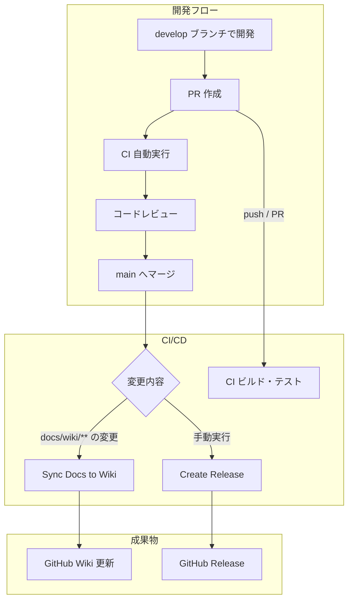
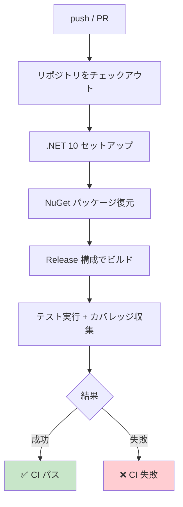
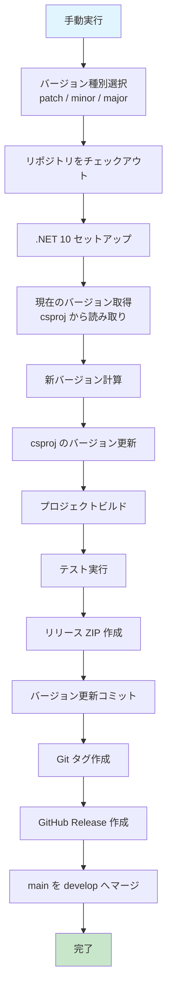
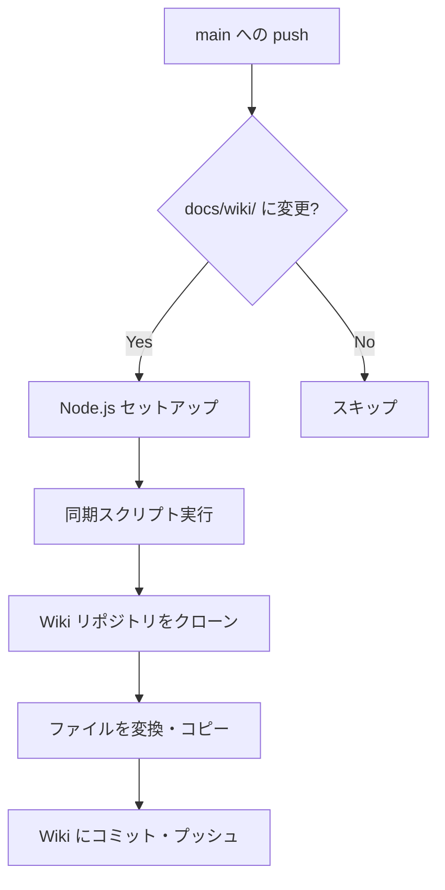

# CI/CD ワークフロー

このドキュメントでは、{{PROJECT_NAME}} プロジェクトの CI/CD ワークフローについて説明します。

<!-- START doctoc generated TOC please keep comment here to allow auto update -->
<!-- DON'T EDIT THIS SECTION, INSTEAD RE-RUN doctoc TO UPDATE -->

- [ワークフロー一覧](#ワークフロー一覧)
- [ローカルでのテスト実行](#ローカルでのテスト実行)
    - [コマンド](#コマンド)
- [全体フロー図](#全体フロー図)
- [1. CI ワークフロー](#1-ci-ワークフロー)
    - [概要](#概要)
    - [トリガー](#トリガー)
    - [処理フロー](#処理フロー)
- [2. Create Release ワークフロー](#2-create-release-ワークフロー)
    - [概要](#概要-1)
    - [トリガー](#トリガー-1)
    - [バージョン種別](#バージョン種別)
    - [ワークフローの実行方法](#ワークフローの実行方法)
    - [処理フロー](#処理フロー-1)
    - [必要なシークレット](#必要なシークレット)
- [3. Sync Docs to Wiki ワークフロー](#3-sync-docs-to-wiki-ワークフロー)
    - [概要](#概要-2)
    - [トリガー](#トリガー-2)
    - [処理フロー](#処理フロー-2)
- [トラブルシューティング](#トラブルシューティング)
    - [CI が失敗する](#ci-が失敗する)
    - [リリースワークフローが失敗する](#リリースワークフローが失敗する)
    - [Wiki ページが同期されない](#wiki-ページが同期されない)
- [関連ドキュメント](#関連ドキュメント)

<!-- END doctoc generated TOC please keep comment here to allow auto update -->

---

## ワークフロー一覧

| ワークフロー      | ファイル        | トリガー                                           | 目的                                  |
| ----------------- | --------------- | -------------------------------------------------- | ------------------------------------- |
| CI                | `ci.yml`        | main / develop への push・PR                       | ビルド・テストの自動実行              |
| Create Release    | `release.yml`   | 手動実行（main ブランチのみ）                      | バージョンアップ、GitHub Release 作成 |
| Sync Docs to Wiki | `sync-wiki.yml` | main への push（docs/wiki 配下の変更時）/ 手動実行 | Wiki ページの自動同期                 |

---

## ローカルでのテスト実行

CI/CD でテストを自動実行する前に、ローカルでテストを実行することを推奨します。

### コマンド

```bash
# 全テストを実行
dotnet test

# 詳細なログを出力
dotnet test --logger "console;verbosity=detailed"

# カバレッジを収集
dotnet test --collect:"XPlat Code Coverage"
```

詳細は[テストガイドライン](testing-guidelines.md)を参照してください。

---

## 全体フロー図



---

## 1. CI ワークフロー

### 概要

プルリクエストおよびブランチへの push 時に、自動的にビルドとテストを実行する。

### トリガー

- `main` / `develop` ブランチへの push
- `main` / `develop` ブランチへのプルリクエスト

### 処理フロー



---

## 2. Create Release ワークフロー

### 概要

手動実行でバージョンアップ、Git タグ作成、GitHub Release の作成を自動化する。

### トリガー

- **手動実行**（`workflow_dispatch`）
- **実行可能ブランチ**: `main` のみ

### バージョン種別

| 種別    | 説明                     | 例            |
| ------- | ------------------------ | ------------- |
| `patch` | バグ修正、小さな変更     | 1.0.0 → 1.0.1 |
| `minor` | 後方互換性のある機能追加 | 1.0.0 → 1.1.0 |
| `major` | 破壊的変更               | 1.0.0 → 2.0.0 |

### ワークフローの実行方法

#### 1. Actions タブを開く

GitHub リポジトリページで **Actions** タブをクリックします。

#### 2. ワークフローを選択

左側のワークフロー一覧から **Create Release** を選択します。

#### 3. Run workflow を実行

**Run workflow** ボタンをクリックし、バージョン種別（patch / minor / major）を選択して実行します。

### 処理フロー



### 必要なシークレット

| シークレット名 | 用途                                         |
| -------------- | -------------------------------------------- |
| `GITHUB_TOKEN` | 自動提供。コミット、タグ、リリース作成に使用 |

<!-- TODO: NuGet 公開が必要な場合は NUGET_API_KEY を追加 -->

---

## 3. Sync Docs to Wiki ワークフロー

### 概要

`docs/wiki/` ディレクトリのMarkdownファイルをGitHub Wikiに自動同期する。

### トリガー

- `main` ブランチへの push（`docs/wiki/**` が変更された場合）
- 手動実行（`workflow_dispatch`）

### 処理フロー



---

## トラブルシューティング

### CI が失敗する

1. ローカルで `dotnet build --configuration Release` が成功するか確認
2. ローカルで `dotnet test` が成功するか確認
3. GitHub Actions のログでエラー内容を確認

### リリースワークフローが失敗する

1. `main` ブランチから実行しているか確認
2. csproj に `<Version>` タグが存在するか確認
3. `develop` ブランチが存在するか確認（リリース後のマージに必要）

### Wiki ページが同期されない

1. `docs/wiki/` 配下のファイルが変更されているか確認
2. GitHub Actions のログを確認
3. Wiki リポジトリが初期化されているか確認（最初に手動でWikiページを1つ作成する必要がある）

---

## 関連ドキュメント

- [ブランチ戦略とリリース手順](branch-strategy.md)
- [テストガイドライン](testing-guidelines.md)
