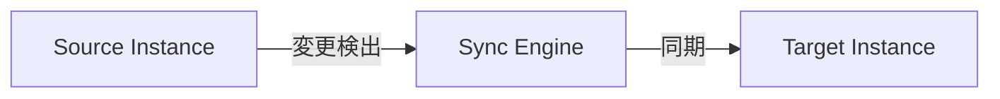

# ドキュメントガイドライン

このドキュメントでは、VehicleVision.Pleasanter.ReplicaSync プロジェクトのドキュメント作成規約について説明します。

<!-- START doctoc generated TOC please keep comment here to allow auto update -->
<!-- DON'T EDIT THIS SECTION, INSTEAD RE-RUN doctoc TO UPDATE -->

- [基本原則](#基本原則)
    - [言語](#言語)
    - [対象読者](#対象読者)
- [ファイル構成](#ファイル構成)
    - [ディレクトリ構造](#ディレクトリ構造)
    - [ファイル命名規則](#ファイル命名規則)
- [Markdownスタイル](#markdownスタイル)
    - [基本ルール](#基本ルール)
    - [型名の表記](#型名の表記)
    - [HTMLタグの使用](#htmlタグの使用)
    - [フォーマッター（Prettier）](#フォーマッターprettier)
    - [Markdownlint](#markdownlint)
    - [npmスクリプト](#npmスクリプト)
    - [目次の自動生成（doctoc）](#目次の自動生成doctoc)
    - [見出し](#見出し)
    - [コードブロック](#コードブロック)
    - [テーブル](#テーブル)
    - [Mermaid図](#mermaid図)
    - [リンク](#リンク)
- [PDF変換](#pdf変換)
    - [利用可能なコマンド](#利用可能なコマンド)
    - [実行例](#実行例)
    - [出力先](#出力先)
    - [PDF設定](#pdf設定)
    - [スタイルのカスタマイズ](#スタイルのカスタマイズ)
    - [VS Codeタスク](#vs-codeタスク)
    - [必要なパッケージ](#必要なパッケージ)
- [ドキュメント同期](#ドキュメント同期)
    - [更新ルール](#更新ルール)
    - [GitHub Wiki同期](#github-wiki同期)
- [参考リンク](#参考リンク)

<!-- END doctoc generated TOC please keep comment here to allow auto update -->

---

## 基本原則

### 言語

- ドキュメントは**日本語**で記述する
- 技術用語は適宜英語のままでも可（例: API, HTTP, JSON）
- コード内のコメント（XMLドキュメントコメント含む）も日本語

### 対象読者

ドキュメントは対象読者によって配置先を分ける。

| 対象読者                     | 配置先                                                              | 内容                                              |
| ---------------------------- | ------------------------------------------------------------------- | ------------------------------------------------- |
| 利用者（製品ユーザー）       | `README.md`、`docs/wiki/`（利用者向け）                             | インストール、設定、操作方法、API リファレンス    |
| 開発者（コントリビューター） | `CONTRIBUTING.md`、`docs/contributing/`、`docs/wiki/`（開発者向け） | 開発環境構築、コーディング規約、内部設計、DB 構造 |

- `README.md` は**利用者向け**。製品概要、クイックスタート、ドキュメントへのリンクを記載
- `CONTRIBUTING.md` は**開発者向け**。ソースコードからのビルド手順、コントリビューション手順を記載
- `docs/wiki/Home.md` では「利用者向け」「開発者向け」セクションを明確に分離する

---

## ファイル構成

### ディレクトリ構造

```text
docs/
├── contributing/                # 開発者向けガイドライン
│   ├── branch-strategy.md
│   ├── ci-workflow.md
│   ├── coding-guidelines.md
│   ├── development-environment.md
│   ├── documentation-guidelines.md
│   └── testing-guidelines.md
├── script/                      # ドキュメント用スクリプト
│   ├── decode-toc.js
│   ├── generate-pdf.js
│   ├── github-markdown.css
│   ├── sync-docs-to-wiki.js
│   └── toc-single.js
└── wiki/
    ├── Home.md                  # Wiki トップページ（利用者/開発者セクション分離）
    ├── installation-*.md        # 利用者向け: インストール手順
    ├── configuration-guide.md   # 利用者向け: 設定方法
    ├── web-manual.md            # 利用者向け: Web UI 操作方法
    ├── web-api-reference.md     # 利用者向け: API 仕様
    ├── architecture-overview.md # 開発者向け: アーキテクチャ
    ├── database-schema.md       # 開発者向け: DB 構造
    └── sync-engine.md           # 開発者向け: 同期エンジン内部
```

### ファイル命名規則

#### `docs/wiki/` 配下

- ケバブケース（`example-document.md`）
- カテゴリごとにサブディレクトリで整理

#### `docs/contributing/` 配下

- ケバブケース（`coding-guidelines.md`）

---

## Markdownスタイル

### 基本ルール

| ルール         | 説明                                             |
| -------------- | ------------------------------------------------ |
| 絵文字禁止     | ドキュメント内で絵文字を使用しない               |
| 図はMermaid    | 図やダイアグラムはMermaid記法を使用する          |
| テーブルの列幅 | 列幅を揃えて見やすく整形する（Prettierで自動化） |
| 見出しレベル   | `#` から順に使用、レベルを飛ばさない             |
| リスト         | `-` を使用（`*` は不可）                         |
| コードブロック | バッククォート3つで囲む                          |

### 型名の表記

テーブル内で型名を記述する場合は、必ずバッククォートで囲むこと：

```markdown
<!-- Good -->

| パラメータ | 型          | 説明         |
| ---------- | ----------- | ------------ |
| `siteId`   | `long`      | サイトID     |
| `timeout`  | `TimeSpan?` | タイムアウト |

<!-- Bad -->

| パラメータ | 型   | 説明     |
| ---------- | ---- | -------- |
| `siteId`   | long | サイトID |
```

### HTMLタグの使用

- **原則禁止**: MarkdownファイルでのHTMLタグ使用は原則禁止
- **例外**: テーブルセル内での改行に限り `<br>` タグの使用を許可

```markdown
<!-- 許可: テーブルセル内での改行 -->

| 項目           | 説明 |
| -------------- | ---- |
| `値A`<br>`値B` | 説明 |

<!-- 禁止: テーブル外でのHTMLタグ -->

テキスト<br>改行 <!-- 代わりに行末スペース2つを使用 -->
```

### フォーマッター（Prettier）

テーブルの列幅整形などはPrettierで自動化されている。

#### セットアップ

1. VS Code拡張機能 `esbenp.prettier-vscode` をインストール
2. `.vscode/extensions.json` に推奨拡張機能として登録済み
3. 保存時に自動フォーマットが適用される

#### 設定ファイル

| ファイル                | 説明                         |
| ----------------------- | ---------------------------- |
| `.prettierrc`           | Prettierの設定               |
| `.prettierignore`       | フォーマット対象外のファイル |
| `.vscode/settings.json` | VS Code用の設定              |

#### Prettier設定の詳細

`.prettierrc` での主要な設定：

| 設定項目        | 値（Markdown） | 説明                             |
| --------------- | -------------- | -------------------------------- |
| `tabWidth`      | `4`            | Markdownでは4スペースインデント  |
| `printWidth`    | `120`          | 1行の最大文字数                  |
| `proseWrap`     | `preserve`     | 文章の折り返しを保持             |
| `endOfLine`     | `lf`           | 改行コードをLFに統一             |
| `useTabs`       | `false`        | タブではなくスペースを使用       |
| `singleQuote`   | `true`         | シングルクォートを優先（JSON等） |
| `trailingComma` | `es5`          | ES5互換の末尾カンマ              |

#### 手動実行

VS Codeで `Shift + Alt + F`（Windows）または `Shift + Option + F`（Mac）でフォーマットを実行。

### Markdownlint

Markdownの構文チェックにはmarkdownlintを使用している。

#### 設定ファイル

| ファイル                   | 説明                    |
| -------------------------- | ----------------------- |
| `.markdownlint-cli2.jsonc` | markdownlint-cli2の設定 |

#### Markdownlint設定の詳細

`.markdownlint-cli2.jsonc` での主要なルール設定：

| ルールID | ルール名           | 設定内容                                 | 説明                                   |
| -------- | ------------------ | ---------------------------------------- | -------------------------------------- |
| `MD007`  | リストのインデント | `indent: 4`                              | 4スペースでインデント                  |
| `MD013`  | 行の長さ           | `line_length: 120`, テーブル・コード除外 | 1行120文字まで、テーブル等は除外       |
| `MD024`  | 重複する見出し     | `siblings_only: true`                    | 同じ階層のみ重複チェック               |
| `MD033`  | HTMLタグ使用禁止   | `allowed_elements: ["br"]`               | `<br>`タグのみ許可（テーブル内改行用） |

### npmスクリプト

ドキュメントのlintとフォーマットはnpmスクリプトで実行できる。

#### 前提条件

Node.js環境が必要。セットアップ方法は[開発環境構築ガイド](development-environment.md)を参照。

> **Note**: 各スクリプトは実行前に `node_modules` の存在をチェックし、存在しない場合は自動的に `npm install` を実行する。そのため、初回実行時に手動で `npm install` を実行する必要はない。

#### 利用可能なスクリプト

| スクリプト     | コマンド               | 説明                                           |
| -------------- | ---------------------- | ---------------------------------------------- |
| `lint:md`      | `npm run lint:md`      | Markdownファイルの構文チェック                 |
| `lint:md:fix`  | `npm run lint:md:fix`  | 自動修正可能なlintエラーを修正                 |
| `format`       | `npm run format`       | Prettierでファイルをフォーマット               |
| `format:check` | `npm run format:check` | フォーマットのチェック（ファイルは変更しない） |
| `toc`          | `npm run toc`          | doctocでTOCを一括更新                          |
| `toc:all`      | `npm run toc:all`      | TOC更新 + Prettierフォーマットを一括実行       |
| `pdf`          | `npm run pdf`          | 全MarkdownファイルをPDFに変換                  |
| `pdf:wiki`     | `npm run pdf:wiki`     | WikiドキュメントのみをPDFに変換                |

#### スクリプトの対象ファイル

各スクリプトの対象ファイルは以下のとおり：

| スクリプト        | `docs/**/*.md` | ルート`*.md` | 備考                                           |
| ----------------- | :------------: | :----------: | ---------------------------------------------- |
| `lint:md`         |      Yes       |     Yes      | 全mdファイル対象                               |
| `lint:md:fix`     |      Yes       |     Yes      | 全mdファイル対象                               |
| `format`          |      Yes       |     Yes      | 全mdファイル対象                               |
| `format:check`    |      Yes       |     Yes      | 全mdファイル対象                               |
| `toc`（doctoc）   |      Yes       |     一部     | ルートは `README.md` と `CONTRIBUTING.md` のみ |
| `toc`（デコード） |      Yes       |     Yes      | 全mdファイル対象                               |
| `pdf`             |      Yes       |     Yes      | 全mdファイルをPDF化                            |
| `pdf:wiki`        |      Yes       |      No      | `docs/wiki/**/*.md` のみ                       |

> **Note**: ルートに新しいmdファイルを追加してTOC生成対象にする場合は、`package.json` の `toc` スクリプトにファイル名を追加すること。

#### 使用例

```bash
# Markdownファイルの構文をチェック
npm run lint:md

# lintエラーを自動修正
npm run lint:md:fix

# フォーマットをチェック（CI向け）
npm run format:check

# ファイルをフォーマット
npm run format

# TOCを一括更新
npm run toc

# TOC更新 + フォーマットを一括実行（推奨）
npm run toc:all
```

#### 推奨ワークフロー

1. 編集後に `npm run lint:md` で構文チェック
2. `npm run lint:md:fix` で自動修正可能なエラーを修正
3. `npm run toc:all` でTOC更新とフォーマットを一括適用
4. コミット前に `npm run format:check` で最終確認

#### VS Codeタスクとの連携

npmスクリプトはVS Codeのタスクとしても登録されている。`Ctrl+Shift+P` → `Tasks: Run Task` から `npm:` で始まるタスクを選択して実行できる。

新しいnpmスクリプトを追加した場合は、以下も更新すること：

| 更新対象                                       | 内容                         |
| ---------------------------------------------- | ---------------------------- |
| `.vscode/tasks.json`                           | 対応するタスクを追加         |
| `docs/contributing/development-environment.md` | ドキュメントタスク一覧に追記 |

### 目次の自動生成（doctoc）

目次の生成・更新は doctoc で自動化されている。

#### セットアップ

doctocはnpmパッケージとしてインストール済み。初回セットアップの場合は `npm install` で依存関係をインストールする。

#### TOCの生成・更新

```bash
# 全ファイルのTOC更新
npm run toc

# TOC更新 + フォーマット
npm run toc:all
```

#### doctocの動作

- `<!-- START doctoc -->` と `<!-- END doctoc -->` の間にTOCを生成
- マーカーがない場合はH1の直後に自動挿入
- `--maxlevel 3` でH3までを目次に含める
- `--notitle` でTOCタイトル（`**Table of Contents**`）を省略
- 日本語リンクはデコードスクリプト（`docs/script/decode-toc.js`）で読みやすい形式に変換

#### 生成されるTOC形式

```markdown
<!-- START doctoc generated TOC please keep comment here to allow auto update -->
<!-- DON'T EDIT THIS SECTION, INSTEAD RE-RUN doctoc TO UPDATE -->

- [概要](#概要)
- [セクション](#セクション) - [サブセクション](#サブセクション)

<!-- END doctoc generated TOC please keep comment here to allow auto update -->
```

#### 注意事項

- doctocはH1（`#`）も目次に含める（除外しない）
- `<!-- omit in toc -->` は **doctocでは使用不可**（Markdown All in One専用）
- `npm run toc` を実行するとdoctoc実行後に自動でデコードスクリプトが実行される

VS Codeでは **RunOnSave** 拡張機能により、`docs/` 配下のMarkdownファイル保存時にTOCが自動更新される。

### 見出し

```markdown
# ドキュメントタイトル（H1は1つのみ）

## 大セクション

### 小セクション

#### サブセクション
```

### コードブロック

言語を必ず指定：

````markdown
```csharp
var engine = new SyncEngine(dbAccess, configRepo);
await engine.SyncAsync(definition);
```
````

### テーブル

列幅を揃えて整形：

```markdown
| プロパティ       | 型       | 説明               |
| ---------------- | -------- | ------------------ |
| `SourceInstance` | `string` | ソースの接続先     |
| `TargetInstance` | `string` | ターゲットの接続先 |
```

### Mermaid図

````markdown

````

### リンク

```markdown
<!-- 相対リンク -->

詳細は[コーディングガイドライン](coding-guidelines.md)を参照。

<!-- セクションへのリンク -->

[基本ルール](#基本ルール)を確認してください。
```

---

## PDF変換

MarkdownファイルをPDFに変換する機能を提供している。GitHubスタイルのCSSを適用し、見やすいPDFを生成できる。

### 利用可能なコマンド

| スクリプト | 対象                | 説明                          |
| ---------- | ------------------- | ----------------------------- |
| `pdf`      | `docs/**/*.md`      | 全MarkdownファイルをPDFに変換 |
| `pdf:wiki` | `docs/wiki/**/*.md` | Wikiドキュメントのみを変換    |

### 実行例

```bash
# 全ドキュメントをPDF化
npm run pdf

# Wikiドキュメントのみ
npm run pdf:wiki
```

### 出力先

PDFは `pdf-output/` ディレクトリに生成される（`.gitignore` で除外済み）。

### PDF設定

| 項目         | 値                                | 説明                                |
| ------------ | --------------------------------- | ----------------------------------- |
| スタイル     | GitHubスタイル                    | 公式の `github-markdown-css` ベース |
| CSSファイル  | `docs/script/github-markdown.css` | ローカルに保存                      |
| フォーマット | A4                                | 用紙サイズ                          |
| マージン     | 20mm（上下左右）                  | 余白                                |
| フォント     | システムフォント（日本語対応）    | Meiryo、Yu Gothic等                 |

### スタイルのカスタマイズ

PDFのスタイルを変更したい場合は、以下のファイルを編集する：

| ファイル                          | 説明                                        |
| --------------------------------- | ------------------------------------------- |
| `docs/script/github-markdown.css` | GitHubスタイルのCSS（幅指定なし）           |
| `docs/script/generate-pdf.js`     | PDF生成スクリプト（マージン、用紙サイズ等） |

### VS Codeタスク

タスクパレット（`Ctrl+Shift+P` → `Tasks: Run Task`）から以下を実行可能：

- `npm: pdf` - 全MarkdownファイルをPDF化
- `npm: pdf:wiki` - WikiドキュメントをPDF化

### 必要なパッケージ

| パッケージ  | 用途                     |
| ----------- | ------------------------ |
| `md-to-pdf` | Markdown→PDF変換エンジン |
| `glob`      | ファイルパターンマッチ   |

初回実行時は自動的に `npm install` が実行される。

---

## ドキュメント同期

### 更新ルール

コードやワークフローを変更した場合は、関連するドキュメントも更新すること。

| 変更内容                     | 更新が必要なドキュメント                                          |
| ---------------------------- | ----------------------------------------------------------------- |
| 公開APIの追加・変更          | `docs/wiki/` 配下の利用者向けドキュメント                         |
| 内部設計の変更               | `docs/wiki/` 配下の開発者向けドキュメント                         |
| 依存パッケージの変更         | `README.md` のサードパーティライセンスセクション                  |
| CI/CDワークフローの変更      | `docs/contributing/ci-workflow.md`                                |
| ガイドラインの追加           | `CONTRIBUTING.md` および `.github/copilot-instructions.md`        |
| プロジェクト設定の変更       | `README.md`（利用者向け）および `.github/copilot-instructions.md` |
| セキュリティ脆弱性の報告対応 | `README.md` の謝辞セクション（報告者名を追記）                    |

### GitHub Wiki同期

- `docs/wiki/` 配下のドキュメントはGitHub Wikiに同期される
- 同期スクリプト: `docs/script/sync-docs-to-wiki.js`
- CI/CDで自動実行される

---

## 参考リンク

- [Markdownガイド](https://www.markdownguide.org/)
- [Mermaid公式ドキュメント](https://mermaid.js.org/)
- [GitHub Flavored Markdown](https://github.github.com/gfm/)
