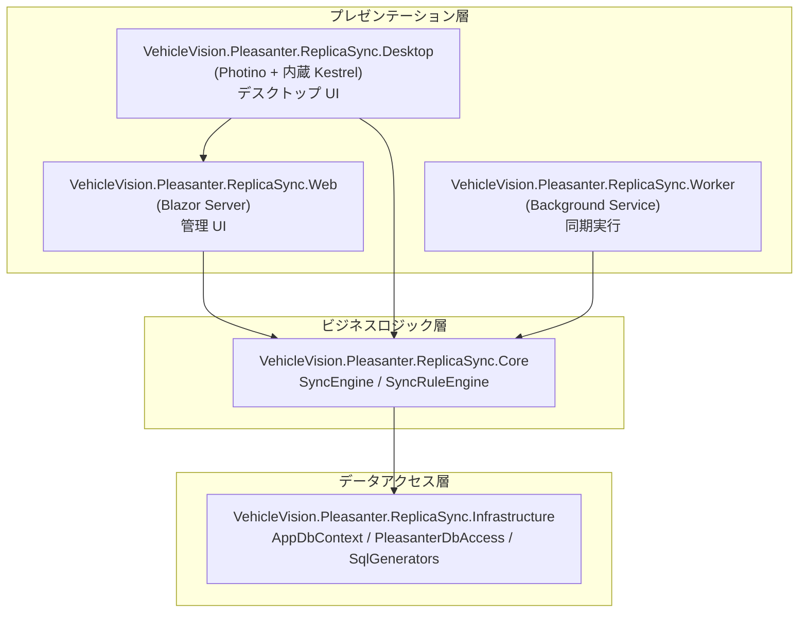
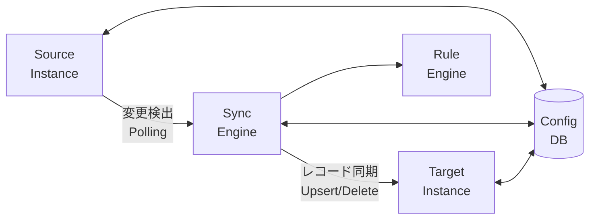
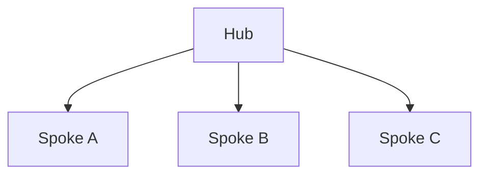
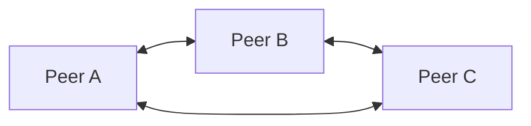

# アーキテクチャ概要

このドキュメントでは、VehicleVision.Pleasanter.ReplicaSync のシステムアーキテクチャについて説明します。

<!-- START doctoc generated TOC please keep comment here to allow auto update -->
<!-- DON'T EDIT THIS SECTION, INSTEAD RE-RUN doctoc TO UPDATE -->

- [システム概要](#システム概要)
- [レイヤー構造](#レイヤー構造)
    - [VehicleVision.Pleasanter.ReplicaSync.Core](#vehiclevisionpleasanterreplicasynccore)
    - [VehicleVision.Pleasanter.ReplicaSync.Infrastructure](#vehiclevisionpleasanterreplicasyncinfrastructure)
    - [VehicleVision.Pleasanter.ReplicaSync.Web](#vehiclevisionpleasanterreplicasyncweb)
    - [VehicleVision.Pleasanter.ReplicaSync.Worker](#vehiclevisionpleasanterreplicasyncworker)
    - [VehicleVision.Pleasanter.ReplicaSync.Desktop](#vehiclevisionpleasanterreplicasyncdesktop)
- [プロジェクト構成](#プロジェクト構成)
- [データフロー](#データフロー)
- [対応データベース](#対応データベース)
- [同期トポロジ](#同期トポロジ)
    - [Hub-Spoke（親子）](#hub-spoke親子)
    - [Peer-to-Peer](#peer-to-peer)

<!-- END doctoc generated TOC please keep comment here to allow auto update -->

## システム概要

VehicleVision.Pleasanter.ReplicaSync は、複数の Pleasanter インスタンス間でデータを同期するためのプラットフォームです。
ADO.NET による直接データベースアクセスを使用し、Pleasanter の Results テーブル、Issues テーブル、および Wikis テーブルのデータを同期します。

## レイヤー構造



### VehicleVision.Pleasanter.ReplicaSync.Core

ビジネスロジック層です。外部ライブラリへの依存を最小限にし、インターフェースを通じてインフラストラクチャ層と連携します。

- **Enums** - `DbmsType`、`SyncStatus`、`TopologyType`、`ConflictResolutionStrategy`、`ChangeDetectionMethod`、`ReferenceType`
- **Interfaces** - `ISyncEngine`、`IPleasanterDbAccess`、`ISyncConfigRepository`
- **Models** - `SyncInstance`、`SyncDefinition`、`SyncTargetMapping`、`PleasanterRecord`、`SyncLogEntry`
- **Services** - `SyncEngine`（同期オーケストレーション）、`SyncRuleEngine`（カラムフィルタリング）

### VehicleVision.Pleasanter.ReplicaSync.Infrastructure

データアクセス層です。EF Core による構成データベースアクセスと、ADO.NET による Pleasanter データベースへの直接アクセスを提供します。

- **Data** - `AppDbContext`（EF Core DbContext）
- **Pleasanter** - `PleasanterDbAccess`（ADO.NET による Pleasanter DB アクセス）
- **SqlGenerators** - DBMS ごとの SQL 生成（`SqlServerSqlGenerator`、`PostgreSqlGenerator`、`MySqlSqlGenerator`）
- **Repositories** - `SyncConfigRepository`（構成データの CRUD）
- **Extensions** - `ServiceCollectionExtensions`（DI 登録）

### VehicleVision.Pleasanter.ReplicaSync.Web

Blazor Server ベースの管理 Web UI です。同期インスタンス、同期定義、同期ログの閲覧・管理ができます。
また、`X-Api-Key` ヘッダーによる API キー認証で保護された Web API エンドポイント（`/api/`）を提供し、外部システムからのプログラマティックな操作を可能にします。

### VehicleVision.Pleasanter.ReplicaSync.Worker

.NET Worker Service としてバックグラウンドで動作し、有効な同期定義を継続的にポーリングして同期処理を実行します。

### VehicleVision.Pleasanter.ReplicaSync.Desktop

クロスプラットフォーム対応のデスクトップアプリケーションです。
Web プロジェクトの Blazor コンポーネントをそのまま再利用し、内蔵 Kestrel サーバ + [Photino](https://www.tryphotino.io/) ネイティブ WebView で動作します。
Web サーバを別途起動する必要がなく、exe を実行するだけで管理 UI が利用できます。

- **Windows**: WebView2（Windows 10/11 に標準搭載）
- **Linux**: WebKitGTK
- **macOS**: WKWebView（OS 標準）

## プロジェクト構成

```text
VehicleVision.Pleasanter.ReplicaSync/
├── src/
│   ├── VehicleVision.Pleasanter.ReplicaSync.Core/            # コアビジネスロジック
│   │   ├── Enums/                   # 列挙型（DbmsType, SyncStatus 等）
│   │   ├── Interfaces/              # インターフェース定義
│   │   ├── Models/                  # データモデル
│   │   └── Services/                # 同期エンジン、ルールエンジン
│   ├── VehicleVision.Pleasanter.ReplicaSync.Infrastructure/  # データアクセス層
│   │   ├── Data/                    # EF Core DbContext
│   │   ├── Pleasanter/              # Pleasanter DB直接アクセス
│   │   └── Repositories/            # 構成リポジトリ
│   ├── VehicleVision.Pleasanter.ReplicaSync.Web/             # Blazor Server Web UI
│   │   └── Components/Pages/        # ダッシュボード等の画面
│   ├── VehicleVision.Pleasanter.ReplicaSync.Desktop/         # デスクトップアプリ (Photino)
│   └── VehicleVision.Pleasanter.ReplicaSync.Worker/          # バックグラウンド同期サービス
├── tests/
│   ├── ReplicaSync.Core.Tests/      # Core ユニットテスト
│   ├── ReplicaSync.Infrastructure.Tests/  # Infrastructure ユニットテスト
│   ├── ReplicaSync.Web.Tests/       # Web ユニットテスト
│   └── ReplicaSync.Web.E2E/         # E2E テスト（Playwright）
├── docs/
│   ├── contributing/                # 開発者向けガイドライン
│   ├── script/                      # ドキュメント用スクリプト
│   └── wiki/                        # Wikiドキュメント
├── .github/                         # GitHub設定（CI/CD、セキュリティポリシー等）
├── LICENSES/                        # サードパーティライセンス
├── CONTRIBUTING.md
├── LICENSE
└── README.md
```

## データフロー



1. Worker サービスが有効な `SyncDefinition` を取得
2. `SyncEngine` がソースインスタンスから変更レコードを検出（ポーリング）
3. `SyncRuleEngine` がカラムフィルタリングルールを適用
4. ターゲットインスタンスに対して Upsert / Delete を実行
5. 同期結果を `SyncLogEntry` として記録

## 対応データベース

| DBMS       | Pleasanter インスタンス | 構成データベース |
| ---------- | ----------------------- | ---------------- |
| SQL Server | 対応                    | 対応             |
| PostgreSQL | 対応                    | 対応             |
| MySQL      | 対応                    | 対応             |

## 同期トポロジ

### Hub-Spoke（親子）

1つのハブ（親）インスタンスと複数のスポーク（子）インスタンス間でデータを同期します。



### Peer-to-Peer

すべてのインスタンスが対等な関係でデータを同期します。


