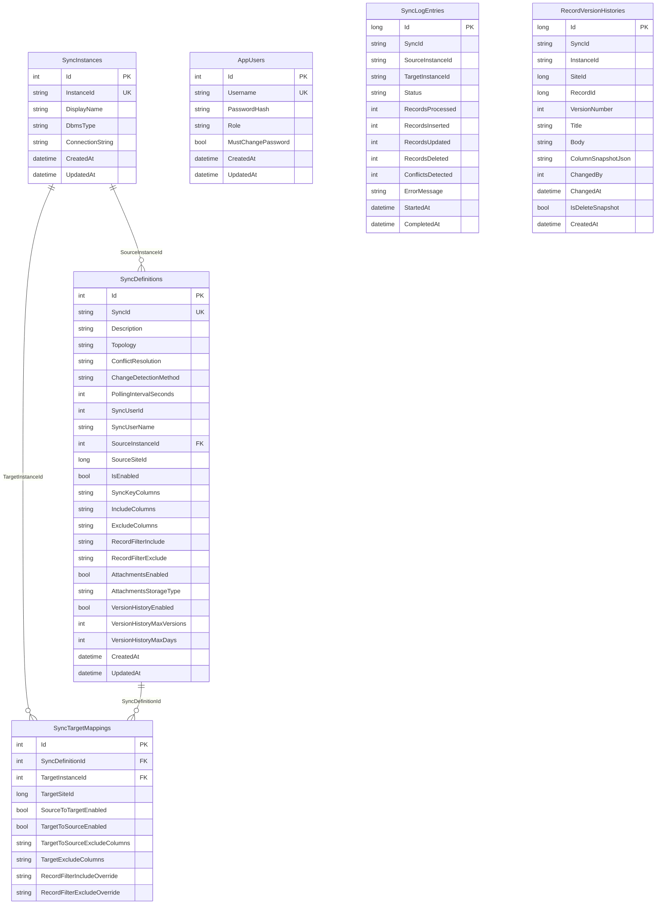

# データベース構造

このドキュメントでは、VehicleVision.Pleasanter.ReplicaSync の構成データベースのテーブル構造について説明します。

<!-- START doctoc generated TOC please keep comment here to allow auto update -->
<!-- DON'T EDIT THIS SECTION, INSTEAD RE-RUN doctoc TO UPDATE -->

- [概要](#概要)
- [ER 図](#er-図)
- [テーブル定義](#テーブル定義)
    - [AppUsers](#appusers)
    - [SyncInstances](#syncinstances)
    - [SyncDefinitions](#syncdefinitions)
    - [SyncTargetMappings](#synctargetmappings)
    - [SyncLogEntries](#synclogentries)
    - [RecordVersionHistories](#recordversionhistories)
- [列挙型の格納値](#列挙型の格納値)
    - [TopologyType](#topologytype)
    - [ConflictResolutionStrategy](#conflictresolutionstrategy)
    - [ChangeDetectionMethod](#changedetectionmethod)
    - [SyncStatus](#syncstatus)
    - [DbmsType](#dbmstype)
    - [AppRole](#approle)
- [リレーションシップ](#リレーションシップ)

<!-- END doctoc generated TOC please keep comment here to allow auto update -->

---

## 概要

構成データベースは EF Core の Code First で管理されます。アプリケーション起動時に `EnsureCreated` で自動作成されます。

対応 DBMS:

| DBMS       | `ConfigDatabaseType` 値 |
| ---------- | ----------------------- |
| SQL Server | `SqlServer`             |
| PostgreSQL | `PostgreSql`            |
| MySQL      | `MySql`                 |

---

## ER 図

---

## テーブル定義

### AppUsers

管理 Web の認証用ユーザーテーブル。初回起動時に初期管理者が自動作成されます。

| カラム名             | 型         | 必須 | 最大長 | 説明                                            |
| -------------------- | ---------- | ---- | ------ | ----------------------------------------------- |
| `Id`                 | `int`      | Yes  | -      | 主キー（自動採番）                              |
| `Username`           | `string`   | Yes  | 100    | ログインユーザー名（ユニーク）                  |
| `PasswordHash`       | `string`   | Yes  | -      | PBKDF2 ハッシュ（`base64salt:base64hash` 形式） |
| `Role`               | `string`   | -    | 50     | 権限ロール（`User` / `Administrator`）          |
| `MustChangePassword` | `bool`     | -    | -      | 次回ログイン時にパスワード変更を強制            |
| `CreatedAt`          | `datetime` | -    | -      | 作成日時（UTC）                                 |
| `UpdatedAt`          | `datetime` | -    | -      | 更新日時（UTC）                                 |

**インデックス:**

| 名前        | カラム     | 種別     |
| ----------- | ---------- | -------- |
| PK          | `Id`       | 主キー   |
| IX_Username | `Username` | ユニーク |

---

### SyncInstances

同期対象の Pleasanter インスタンス接続情報。

| カラム名           | 型         | 必須 | 最大長 | 説明                                                 |
| ------------------ | ---------- | ---- | ------ | ---------------------------------------------------- |
| `Id`               | `int`      | Yes  | -      | 主キー（自動採番）                                   |
| `InstanceId`       | `string`   | Yes  | 100    | インスタンス識別子（例: `headquarters`）（ユニーク） |
| `DisplayName`      | `string`   | Yes  | 200    | 表示名                                               |
| `DbmsType`         | `string`   | -    | -      | DBMS 種別（`SqlServer` / `PostgreSql` / `MySql`）    |
| `ConnectionString` | `string`   | Yes  | -      | Pleasanter データベースへの接続文字列                |
| `CreatedAt`        | `datetime` | -    | -      | 作成日時（UTC）                                      |
| `UpdatedAt`        | `datetime` | -    | -      | 更新日時（UTC）                                      |

**インデックス:**

| 名前          | カラム       | 種別     |
| ------------- | ------------ | -------- |
| PK            | `Id`         | 主キー   |
| IX_InstanceId | `InstanceId` | ユニーク |

---

### SyncDefinitions

データ同期のルール定義。

| カラム名                    | 型         | 必須 | 最大長 | 説明                                             |
| --------------------------- | ---------- | ---- | ------ | ------------------------------------------------ |
| `Id`                        | `int`      | Yes  | -      | 主キー（自動採番）                               |
| `SyncId`                    | `string`   | Yes  | 100    | 同期定義識別子（ユニーク）                       |
| `Description`               | `string`   | -    | 500    | 説明                                             |
| `Topology`                  | `string`   | -    | 50     | トポロジー（`HubSpoke` / `PeerToPeer`）          |
| `ConflictResolution`        | `string`   | -    | 50     | 競合解決戦略（後述）                             |
| `ChangeDetectionMethod`     | `string`   | -    | 50     | 変更検出方法（現在は `Polling` のみ）            |
| `PollingIntervalSeconds`    | `int`      | -    | -      | ポーリング間隔（1～3600 秒、既定: 5）            |
| `SyncUserId`                | `int`      | -    | -      | 同期操作に使用する Pleasanter ユーザー ID        |
| `SyncUserName`              | `string`   | -    | 100    | 同期ユーザーの表示名                             |
| `SourceInstanceId`          | `int`      | -    | -      | ソースインスタンス ID（FK → `SyncInstances.Id`） |
| `SourceSiteId`              | `long`     | -    | -      | ソース Pleasanter サイト ID                      |
| `IsEnabled`                 | `bool`     | -    | -      | 有効/無効（既定: `true`）                        |
| `SyncKeyColumns`            | `string`   | Yes  | 500    | 同期キーカラム（カンマ区切り）                   |
| `IncludeColumns`            | `string`   | -    | 2000   | 同期対象カラム（カンマ区切り）                   |
| `ExcludeColumns`            | `string`   | -    | 2000   | 同期除外カラム（カンマ区切り）                   |
| `RecordFilterInclude`       | `string`   | -    | 4000   | レコードフィルタ（含む条件、JSON）               |
| `RecordFilterExclude`       | `string`   | -    | 4000   | レコードフィルタ（除外条件、JSON）               |
| `AttachmentsEnabled`        | `bool`     | -    | -      | 添付ファイル同期の有効/無効                      |
| `AttachmentsStorageType`    | `string`   | -    | 50     | 添付ファイル保存方式（既定: `Rds`）              |
| `VersionHistoryEnabled`     | `bool`     | -    | -      | バージョン履歴の有効/無効（既定: `true`）        |
| `VersionHistoryMaxVersions` | `int?`     | -    | -      | 最大保持版数（`null` = 無制限、既定: 20）        |
| `VersionHistoryMaxDays`     | `int?`     | -    | -      | 最大保持日数（`null` = 無制限、既定: 180）       |
| `CreatedAt`                 | `datetime` | -    | -      | 作成日時（UTC）                                  |
| `UpdatedAt`                 | `datetime` | -    | -      | 更新日時（UTC）                                  |

**インデックス:**

| 名前      | カラム   | 種別     |
| --------- | -------- | -------- |
| PK        | `Id`     | 主キー   |
| IX_SyncId | `SyncId` | ユニーク |

**外部キー:**

| カラム             | 参照先             | 削除時動作 |
| ------------------ | ------------------ | ---------- |
| `SourceInstanceId` | `SyncInstances.Id` | Restrict   |

---

### SyncTargetMappings

同期定義に対するターゲットインスタンスのマッピング。

| カラム名                       | 型       | 必須 | 最大長 | 説明                                                 |
| ------------------------------ | -------- | ---- | ------ | ---------------------------------------------------- |
| `Id`                           | `int`    | Yes  | -      | 主キー（自動採番）                                   |
| `SyncDefinitionId`             | `int`    | -    | -      | 親同期定義 ID（FK → `SyncDefinitions.Id`）           |
| `TargetInstanceId`             | `int`    | -    | -      | ターゲットインスタンス ID（FK → `SyncInstances.Id`） |
| `TargetSiteId`                 | `long`   | -    | -      | ターゲット Pleasanter サイト ID                      |
| `SourceToTargetEnabled`        | `bool`   | -    | -      | ソース → ターゲット同期有効（既定: `true`）          |
| `TargetToSourceEnabled`        | `bool`   | -    | -      | ターゲット → ソース同期有効（既定: `false`）         |
| `TargetToSourceExcludeColumns` | `string` | -    | 2000   | ターゲット → ソースで除外するカラム                  |
| `TargetExcludeColumns`         | `string` | -    | 2000   | ターゲット側で除外するカラム                         |
| `RecordFilterIncludeOverride`  | `string` | -    | 4000   | レコードフィルタ（含む）のターゲット上書き（JSON）   |
| `RecordFilterExcludeOverride`  | `string` | -    | 4000   | レコードフィルタ（除外）のターゲット上書き（JSON）   |

**外部キー:**

| カラム             | 参照先               | 削除時動作 |
| ------------------ | -------------------- | ---------- |
| `SyncDefinitionId` | `SyncDefinitions.Id` | Cascade    |
| `TargetInstanceId` | `SyncInstances.Id`   | Restrict   |

---

### SyncLogEntries

同期処理の実行ログ。

| カラム名            | 型         | 必須 | 最大長 | 説明                                                        |
| ------------------- | ---------- | ---- | ------ | ----------------------------------------------------------- |
| `Id`                | `long`     | Yes  | -      | 主キー（自動採番）                                          |
| `SyncId`            | `string`   | Yes  | 100    | 同期定義 ID                                                 |
| `SourceInstanceId`  | `string`   | -    | 100    | ソースインスタンス ID                                       |
| `TargetInstanceId`  | `string`   | -    | 100    | ターゲットインスタンス ID                                   |
| `Status`            | `string`   | -    | 50     | ステータス（`Success` / `Failed` / `Conflict` / `Skipped`） |
| `RecordsProcessed`  | `int`      | -    | -      | 処理レコード数                                              |
| `RecordsInserted`   | `int`      | -    | -      | 挿入レコード数                                              |
| `RecordsUpdated`    | `int`      | -    | -      | 更新レコード数                                              |
| `RecordsDeleted`    | `int`      | -    | -      | 削除レコード数                                              |
| `ConflictsDetected` | `int`      | -    | -      | 検出された競合数                                            |
| `ErrorMessage`      | `string`   | -    | 4000   | エラーメッセージ                                            |
| `StartedAt`         | `datetime` | -    | -      | 同期開始日時                                                |
| `CompletedAt`       | `datetime` | -    | -      | 同期完了日時                                                |

**インデックス:**

| 名前         | カラム      | 種別       |
| ------------ | ----------- | ---------- |
| PK           | `Id`        | 主キー     |
| IX_SyncId    | `SyncId`    | 非ユニーク |
| IX_StartedAt | `StartedAt` | 非ユニーク |

---

### RecordVersionHistories

同期処理でレコードが上書きされる前の状態を保存するバージョン履歴。保持ポリシーにより版数・日数で自動クリーンアップされます。

| カラム名             | 型         | 必須 | 最大長 | 説明                                                |
| -------------------- | ---------- | ---- | ------ | --------------------------------------------------- |
| `Id`                 | `long`     | Yes  | -      | 主キー（自動採番）                                  |
| `SyncId`             | `string`   | Yes  | 100    | 同期定義 ID                                         |
| `InstanceId`         | `string`   | Yes  | 100    | スナップショット取得先インスタンス ID               |
| `SiteId`             | `long`     | -    | -      | Pleasanter サイト ID                                |
| `RecordId`           | `long`     | -    | -      | Pleasanter レコード ID（ResultId / IssueId）        |
| `VersionNumber`      | `int`      | -    | -      | レコード単位の連番（1 始まり）                      |
| `Title`              | `string`   | -    | 2048   | スナップショット時点のタイトル                      |
| `Body`               | `string`   | -    | -      | スナップショット時点の本文                          |
| `ColumnSnapshotJson` | `string`   | -    | -      | カラム値の JSON スナップショット                    |
| `ChangedBy`          | `int`      | -    | -      | スナップショット時点の最終更新 Pleasanter ユーザー  |
| `ChangedAt`          | `datetime` | -    | -      | スナップショット時点のレコード更新日時              |
| `IsDeleteSnapshot`   | `bool`     | -    | -      | 削除前スナップショット（`true`）か更新前（`false`） |
| `CreatedAt`          | `datetime` | -    | -      | 履歴エントリ作成日時（UTC）                         |

**インデックス:**

| 名前                       | カラム                                                        | 種別       |
| -------------------------- | ------------------------------------------------------------- | ---------- |
| PK                         | `Id`                                                          | 主キー     |
| IX_Record_Version (UNIQUE) | `SyncId`, `InstanceId`, `SiteId`, `RecordId`, `VersionNumber` | ユニーク   |
| IX_SyncId_CreatedAt        | `SyncId`, `CreatedAt`                                         | 非ユニーク |

**保持ポリシー:**

同期定義の `VersionHistoryMaxVersions` と `VersionHistoryMaxDays` で制御されます。
両方の条件が設定されている場合、**いずれか早いほう**で削除されます（既定: 20 版 or 180 日）。
`null` を設定するとその条件は無制限になります。両方 `null` の場合は履歴が無制限に保持されます。

---

## 列挙型の格納値

enum 型のカラムはすべて文字列（`HasConversion<string>()`）として格納されます。

### TopologyType

| 値           | 説明                               |
| ------------ | ---------------------------------- |
| `HubSpoke`   | ハブ・スポーク（親子）トポロジー   |
| `PeerToPeer` | ピア・ツー・ピア（対等）トポロジー |

### ConflictResolutionStrategy

| 値                 | 説明                                                 |
| ------------------ | ---------------------------------------------------- |
| `SourceWins`       | ソース（親）データが常に優先                         |
| `LastWriteWins`    | 最新の更新が優先（`UpdatedTime` で判定）             |
| `ManualResolution` | 競合をログに記録して手動解決                         |
| `FieldLevelMerge`  | 各列の最終更新時刻を比較してフィールドレベルでマージ |

### ChangeDetectionMethod

| 値        | 説明                                   |
| --------- | -------------------------------------- |
| `Polling` | `UpdatedTime` の比較に基づくポーリング |

### SyncStatus

| 値         | 説明     |
| ---------- | -------- |
| `Success`  | 成功     |
| `Failed`   | 失敗     |
| `Conflict` | 競合あり |
| `Skipped`  | スキップ |

### DbmsType

| 値           | 説明       |
| ------------ | ---------- |
| `SqlServer`  | SQL Server |
| `PostgreSql` | PostgreSQL |
| `MySql`      | MySQL      |

### AppRole

| 値              | 説明                                   |
| --------------- | -------------------------------------- |
| `User`          | 通常ユーザー（同期状況の閲覧のみ）     |
| `Administrator` | 管理者（ユーザー管理・設定変更が可能） |

---

## リレーションシップ

| 親テーブル        | 子テーブル           | 関係 | 削除時動作 |
| ----------------- | -------------------- | ---- | ---------- |
| `SyncInstances`   | `SyncDefinitions`    | 1:N  | Restrict   |
| `SyncInstances`   | `SyncTargetMappings` | 1:N  | Restrict   |
| `SyncDefinitions` | `SyncTargetMappings` | 1:N  | Cascade    |

- **Restrict**: 子レコードが存在する場合、親レコードの削除を禁止
- **Cascade**: 親レコード削除時に子レコードも自動削除
