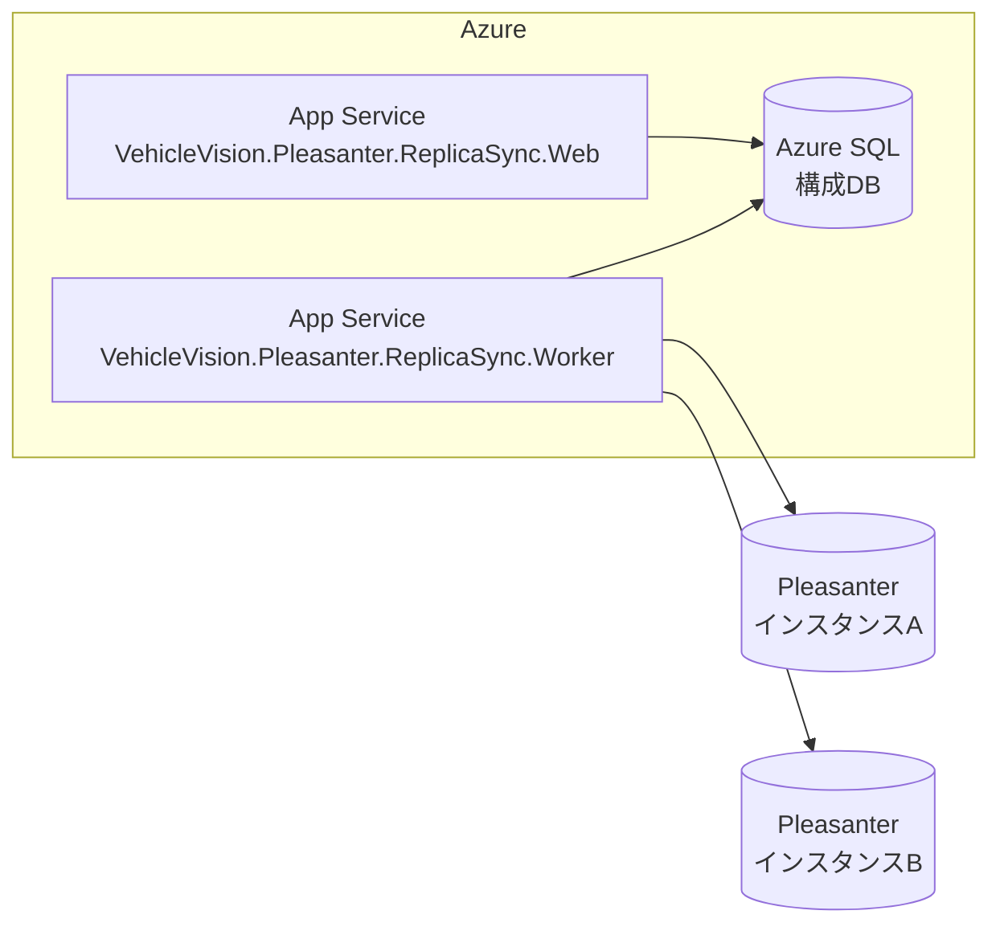

# インストールガイド - Azure 環境

このドキュメントでは、VehicleVision.Pleasanter.ReplicaSync を Azure 環境にデプロイする手順を説明します。

<!-- START doctoc generated TOC please keep comment here to allow auto update -->
<!-- DON'T EDIT THIS SECTION, INSTEAD RE-RUN doctoc TO UPDATE -->

- [前提条件](#前提条件)
- [Azure リソース構成](#azure-リソース構成)
- [手順 1: リソースグループの作成](#手順-1-リソースグループの作成)
- [手順 2: 構成データベースの作成](#手順-2-構成データベースの作成)
    - [SQL Server の場合](#sql-server-の場合)
    - [PostgreSQL の場合](#postgresql-の場合)
    - [MySQL の場合](#mysql-の場合)
- [手順 3: App Service プランの作成](#手順-3-app-service-プランの作成)
- [手順 4: アプリケーションの取得と発行](#手順-4-アプリケーションの取得と発行)
    - [方法 A: NuGet パッケージ（推奨）](#方法-a-nuget-パッケージ推奨)
    - [方法 B: ソースコードからビルド](#方法-b-ソースコードからビルド)
- [手順 5: Web アプリのデプロイ](#手順-5-web-アプリのデプロイ)
- [手順 6: Worker サービスのデプロイ](#手順-6-worker-サービスのデプロイ)
- [手順 7: ネットワーク設定](#手順-7-ネットワーク設定)
    - [Pleasanter が Azure 上にある場合](#pleasanter-が-azure-上にある場合)
    - [Pleasanter がオンプレミスにある場合](#pleasanter-がオンプレミスにある場合)
- [手順 8: 動作確認](#手順-8-動作確認)
- [構成データベースの接続文字列の例](#構成データベースの接続文字列の例)
    - [SQL Server（Azure SQL Database）](#sql-serverazure-sql-database)
    - [PostgreSQL（Azure Database for PostgreSQL）](#postgresqlazure-database-for-postgresql)
    - [MySQL（Azure Database for MySQL）](#mysqlazure-database-for-mysql)
- [セキュリティに関する推奨事項](#セキュリティに関する推奨事項)
- [トラブルシューティング](#トラブルシューティング)
    - [Worker が停止する](#worker-が停止する)
    - [データベースに接続できない](#データベースに接続できない)
    - [ログの確認方法](#ログの確認方法)

<!-- END doctoc generated TOC please keep comment here to allow auto update -->

## 前提条件

- Azure サブスクリプション
- [Azure CLI](https://learn.microsoft.com/ja-jp/cli/azure/install-azure-cli) v2.60 以上
- [.NET 10 SDK](https://dotnet.microsoft.com/download/dotnet/10.0)
- Git

## Azure リソース構成

ReplicaSync のデプロイに必要な Azure リソースは以下の通りです。

| リソース                      | 用途                                  | 推奨 SKU       |
| ----------------------------- | ------------------------------------- | -------------- |
| Azure App Service             | Web UI（Blazor Server）のホスト       | B1 以上        |
| Azure App Service             | Worker サービスのホスト               | B1 以上        |
| Azure SQL Database            | 構成データベース                      | Basic / S0     |
| Azure Database for PostgreSQL | 構成データベース（PostgreSQL 選択時） | Burstable B1ms |
| Azure Database for MySQL      | 構成データベース（MySQL 選択時）      | Burstable B1ms |

> **注意**: Worker サービスは Azure App Service の「常時接続」を有効にするか、Azure Container Apps / Azure VM 上で稼働させることを推奨します。Free / Shared SKU では常時接続がサポートされません。



## 手順 1: リソースグループの作成

```bash
az login
az group create --name rg-replicasync --location japaneast
```

## 手順 2: 構成データベースの作成

構成データベースの DBMS に応じて、いずれかの手順を実行します。

### SQL Server の場合

```bash
# SQL Server の作成
az sql server create \
  --name sql-replicasync \
  --resource-group rg-replicasync \
  --location japaneast \
  --admin-user sqladmin \
  --admin-password '<強力なパスワード>'

# ファイアウォールルール（Azure サービスからのアクセスを許可）
az sql server firewall-rule create \
  --resource-group rg-replicasync \
  --server sql-replicasync \
  --name AllowAzureServices \
  --start-ip-address 0.0.0.0 \
  --end-ip-address 0.0.0.0

# データベースの作成
az sql db create \
  --resource-group rg-replicasync \
  --server sql-replicasync \
  --name ReplicaSync \
  --service-objective Basic
```

### PostgreSQL の場合

```bash
az postgres flexible-server create \
  --resource-group rg-replicasync \
  --name psql-replicasync \
  --location japaneast \
  --admin-user pgadmin \
  --admin-password '<強力なパスワード>' \
  --sku-name Standard_B1ms \
  --tier Burstable \
  --version 16

az postgres flexible-server db create \
  --resource-group rg-replicasync \
  --server-name psql-replicasync \
  --database-name replicasync
```

### MySQL の場合

```bash
az mysql flexible-server create \
  --resource-group rg-replicasync \
  --name mysql-replicasync \
  --location japaneast \
  --admin-user mysqladmin \
  --admin-password '<強力なパスワード>' \
  --sku-name Standard_B1ms \
  --tier Burstable \
  --version 8.0.21

az mysql flexible-server db create \
  --resource-group rg-replicasync \
  --server-name mysql-replicasync \
  --database-name replicasync
```

## 手順 3: App Service プランの作成

```bash
az appservice plan create \
  --name plan-replicasync \
  --resource-group rg-replicasync \
  --location japaneast \
  --sku B1 \
  --is-linux
```

## 手順 4: アプリケーションの取得と発行

アプリケーションの取得方法は、NuGet パッケージとソースコードからのビルドの 2 つから選択できます。

### 方法 A: NuGet パッケージ（推奨）

NuGet パッケージを使用すると、ソースコードのクローンが不要です。詳細は [NuGet パッケージによるインストール](installation-nuget.md) を参照してください。

### 方法 B: ソースコードからビルド

```bash
# リポジトリのクローン
git clone https://github.com/vehiclevisionjp/VehicleVision.Pleasanter.ReplicaSync.git
cd VehicleVision.Pleasanter.ReplicaSync

# Web UI のビルド
dotnet publish src/VehicleVision.Pleasanter.ReplicaSync.Web/ReplicaSync.Web.csproj \
  --configuration Release \
  --output ./publish/web

# Worker サービスのビルド
dotnet publish src/VehicleVision.Pleasanter.ReplicaSync.Worker/ReplicaSync.Worker.csproj \
  --configuration Release \
  --output ./publish/worker
```

## 手順 5: Web アプリのデプロイ

```bash
# Web App の作成
az webapp create \
  --name app-replicasync-web \
  --resource-group rg-replicasync \
  --plan plan-replicasync \
  --runtime 'DOTNETCORE:10.0'

# アプリ設定（SQL Server の場合）
az webapp config connection-string set \
  --name app-replicasync-web \
  --resource-group rg-replicasync \
  --connection-string-type SQLAzure \
  --settings ConfigDatabase='Server=tcp:sql-replicasync.database.windows.net,1433;Database=ReplicaSync;User ID=sqladmin;Password=<パスワード>;Encrypt=True;TrustServerCertificate=False;'

az webapp config appsettings set \
  --name app-replicasync-web \
  --resource-group rg-replicasync \
  --settings ConfigDatabaseType=SqlServer

# デプロイ
cd publish/web
zip -r ../web.zip .
az webapp deploy \
  --name app-replicasync-web \
  --resource-group rg-replicasync \
  --src-path ../web.zip \
  --type zip
```

## 手順 6: Worker サービスのデプロイ

```bash
# Worker App の作成
az webapp create \
  --name app-replicasync-worker \
  --resource-group rg-replicasync \
  --plan plan-replicasync \
  --runtime 'DOTNETCORE:10.0'

# 常時接続を有効化（Worker が停止しないようにする）
az webapp config set \
  --name app-replicasync-worker \
  --resource-group rg-replicasync \
  --always-on true

# アプリ設定（SQL Server の場合）
az webapp config connection-string set \
  --name app-replicasync-worker \
  --resource-group rg-replicasync \
  --connection-string-type SQLAzure \
  --settings ConfigDatabase='Server=tcp:sql-replicasync.database.windows.net,1433;Database=ReplicaSync;User ID=sqladmin;Password=<パスワード>;Encrypt=True;TrustServerCertificate=False;'

az webapp config appsettings set \
  --name app-replicasync-worker \
  --resource-group rg-replicasync \
  --settings ConfigDatabaseType=SqlServer

# デプロイ
cd ../worker
zip -r ../worker.zip .
az webapp deploy \
  --name app-replicasync-worker \
  --resource-group rg-replicasync \
  --src-path ../worker.zip \
  --type zip
```

## 手順 7: ネットワーク設定

Pleasanter インスタンスのデータベースへのアクセスが必要なため、ネットワーク接続を構成します。

### Pleasanter が Azure 上にある場合

- App Service と Pleasanter DB が同じ VNet 内にある場合は、VNet 統合を使用します

```bash
# VNet 統合の設定
az webapp vnet-integration add \
  --name app-replicasync-worker \
  --resource-group rg-replicasync \
  --vnet <VNet名> \
  --subnet <サブネット名>
```

### Pleasanter がオンプレミスにある場合

- Azure VPN Gateway または ExpressRoute を使用してオンプレミスネットワークと接続します
- App Service の VNet 統合を有効にし、オンプレミスへのルーティングを構成します

## 手順 8: 動作確認

1. Web UI にアクセスして管理画面が表示されることを確認します

    ```text
    https://app-replicasync-web.azurewebsites.net
    ```

2. Web UI から同期インスタンスと同期定義を登録します
3. Worker サービスのログで同期処理が実行されていることを確認します

    ```bash
    az webapp log tail \
      --name app-replicasync-worker \
      --resource-group rg-replicasync
    ```

## 構成データベースの接続文字列の例

### SQL Server（Azure SQL Database）

```json
{
    "ConnectionStrings": {
        "ConfigDatabase": "Server=tcp:sql-replicasync.database.windows.net,1433;Database=ReplicaSync;User ID=sqladmin;Password=<パスワード>;Encrypt=True;TrustServerCertificate=False;"
    },
    "ConfigDatabaseType": "SqlServer"
}
```

### PostgreSQL（Azure Database for PostgreSQL）

```json
{
    "ConnectionStrings": {
        "ConfigDatabase": "Host=psql-replicasync.postgres.database.azure.com;Database=replicasync;Username=pgadmin;Password=<パスワード>;SSL Mode=Require;Trust Server Certificate=true;"
    },
    "ConfigDatabaseType": "PostgreSql"
}
```

### MySQL（Azure Database for MySQL）

```json
{
    "ConnectionStrings": {
        "ConfigDatabase": "Server=mysql-replicasync.mysql.database.azure.com;Database=replicasync;User=mysqladmin;Password=<パスワード>;SslMode=Required;"
    },
    "ConfigDatabaseType": "MySql"
}
```

## セキュリティに関する推奨事項

- **接続文字列**: Azure App Service のアプリ設定または Azure Key Vault を使用して管理し、コードや構成ファイルにハードコードしないでください
- **認証**: 可能な場合はマネージド ID を使用し、データベースへのパスワードレス認証を推奨します
- **ネットワーク**: Private Endpoint や VNet 統合を使用し、データベースへのパブリックアクセスを制限してください
- **TLS**: すべての通信で TLS 1.2 以上を使用してください
- **ログ**: 接続文字列やパスワードがログに出力されないよう注意してください

## トラブルシューティング

### Worker が停止する

- App Service の「常時接続（Always On）」が有効になっていることを確認してください
- Free / Shared SKU では Always On がサポートされないため、B1 以上にスケールアップしてください

### データベースに接続できない

- ファイアウォールルールで App Service の送信 IP アドレスからのアクセスが許可されているか確認してください
- VNet 統合を使用している場合は、NSG（ネットワークセキュリティグループ）の規則を確認してください

### ログの確認方法

```bash
# リアルタイムログの表示
az webapp log tail --name app-replicasync-worker --resource-group rg-replicasync

# 診断ログの有効化
az webapp log config \
  --name app-replicasync-worker \
  --resource-group rg-replicasync \
  --application-logging filesystem \
  --level information
```
