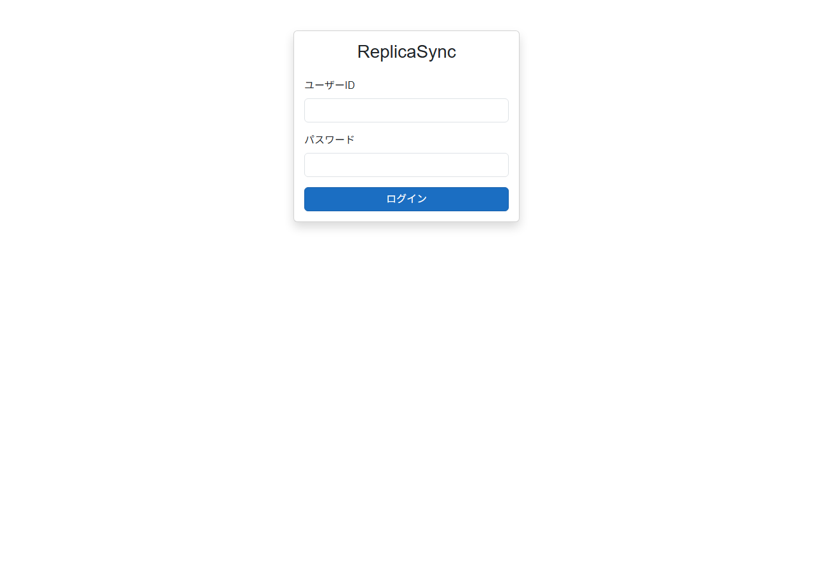
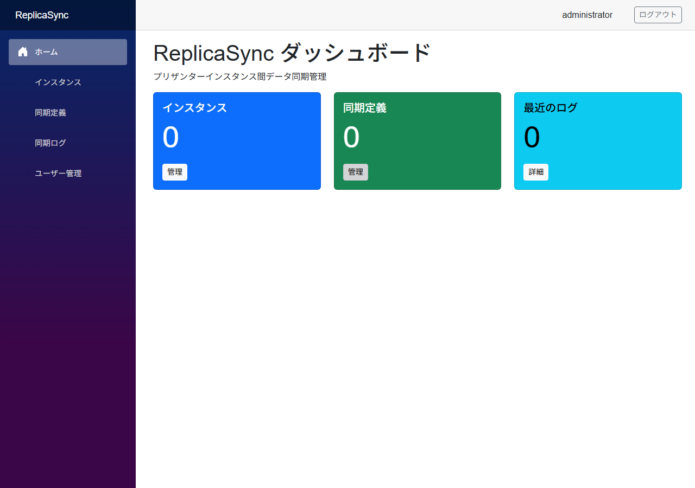
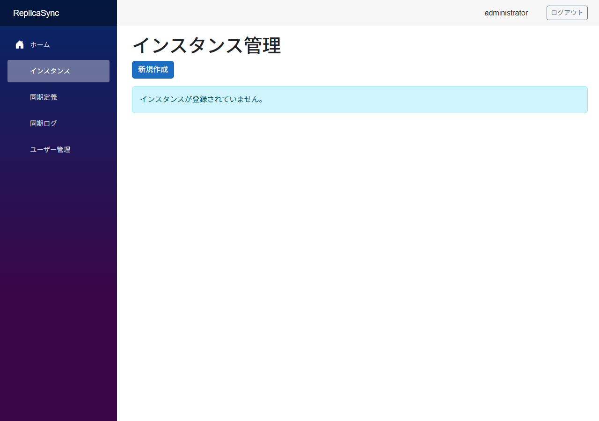
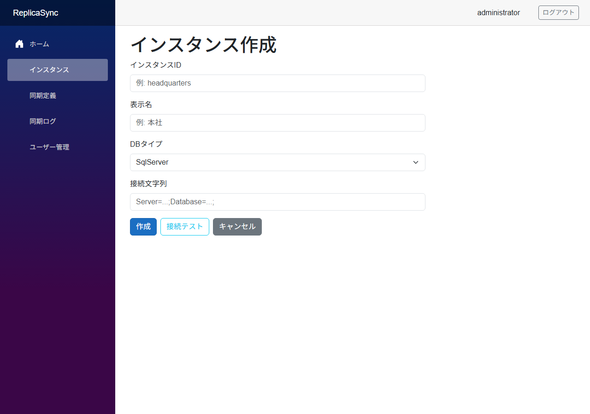
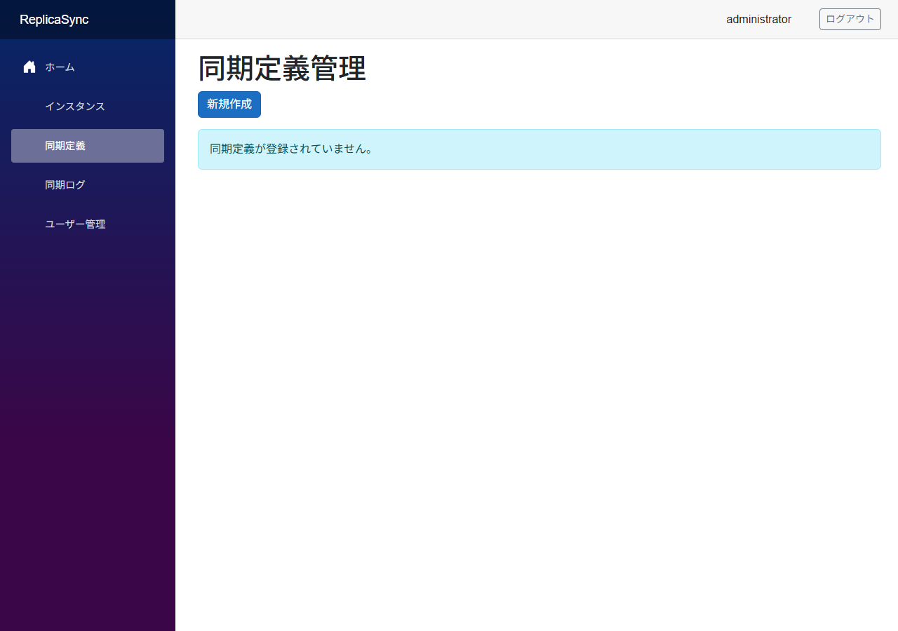
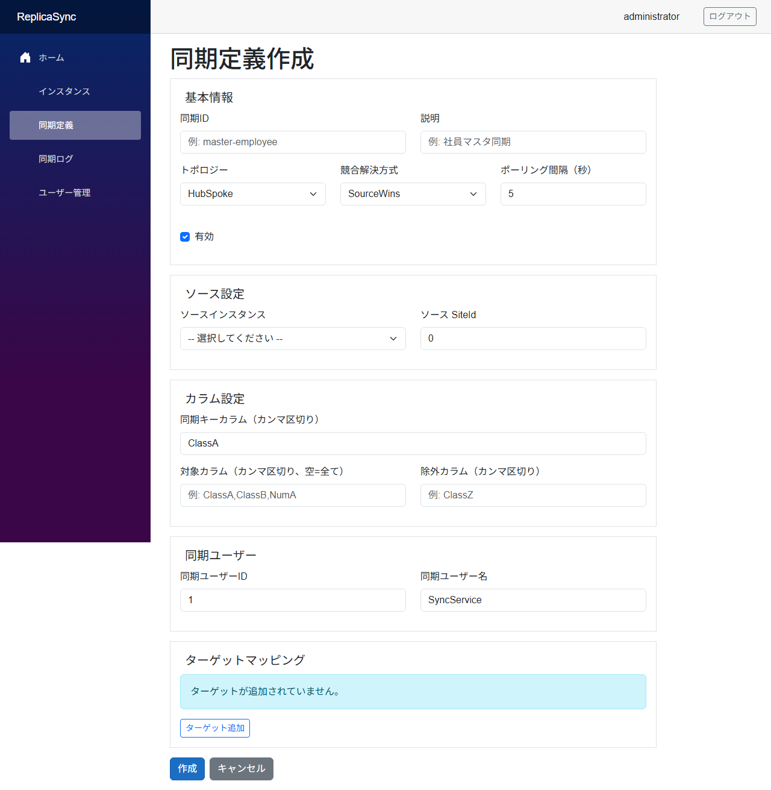
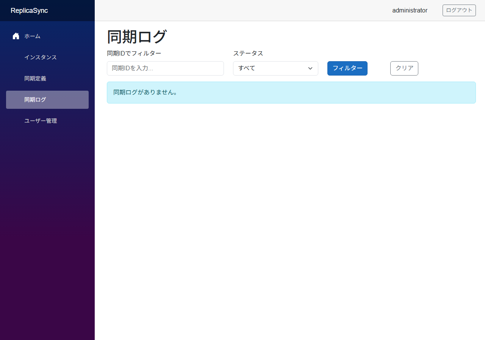
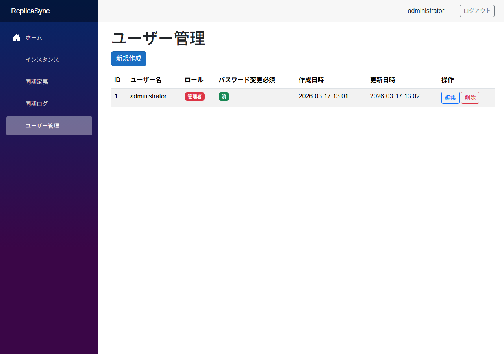
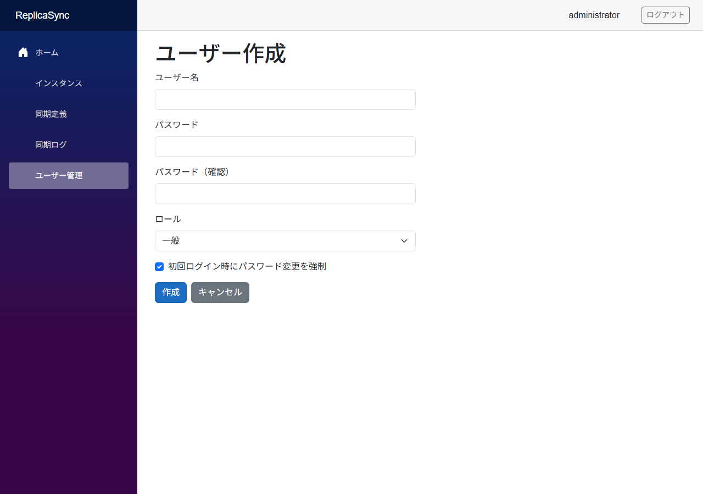
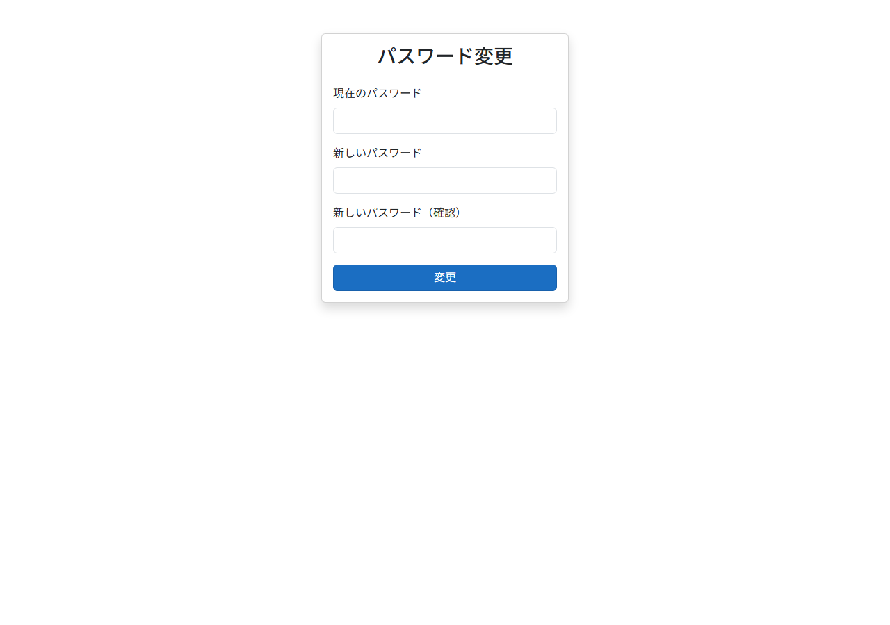

# Web UI 取扱説明書

VehicleVision.Pleasanter.ReplicaSync.Web 管理画面の操作方法について説明します。

<!-- START doctoc generated TOC please keep comment here to allow auto update -->
<!-- DON'T EDIT THIS SECTION, INSTEAD RE-RUN doctoc TO UPDATE -->

- [概要](#概要)
- [アクセス方法](#アクセス方法)
    - [URL](#url)
    - [対応ブラウザ](#対応ブラウザ)
- [ログイン](#ログイン)
    - [初回ログイン](#初回ログイン)
    - [ログイン手順](#ログイン手順)
    - [ログアウト](#ログアウト)
- [画面構成](#画面構成)
    - [ナビゲーションメニュー](#ナビゲーションメニュー)
- [ダッシュボード](#ダッシュボード)
    - [表示内容](#表示内容)
- [インスタンス管理](#インスタンス管理)
    - [一覧画面](#一覧画面)
    - [新規作成](#新規作成)
    - [編集](#編集)
    - [削除](#削除)
- [同期定義管理](#同期定義管理)
    - [一覧画面](#一覧画面-1)
    - [新規作成](#新規作成-1)
    - [編集](#編集-1)
    - [削除](#削除-1)
- [同期ログ](#同期ログ)
    - [一覧画面](#一覧画面-2)
    - [フィルタリング](#フィルタリング)
- [ユーザー管理](#ユーザー管理)
    - [一覧画面](#一覧画面-3)
    - [新規作成](#新規作成-2)
    - [編集](#編集-2)
    - [削除](#削除-2)
- [パスワード変更](#パスワード変更)
    - [入力項目](#入力項目)
    - [初回パスワード変更](#初回パスワード変更)
- [ロールと権限](#ロールと権限)
- [スクリーンショットの自動取得](#スクリーンショットの自動取得)
    - [前提条件](#前提条件)
    - [手順](#手順)
    - [出力ファイル](#出力ファイル)

<!-- END doctoc generated TOC please keep comment here to allow auto update -->

---

## 概要

VehicleVision.Pleasanter.ReplicaSync.Web は、プリザンターインスタンス間のデータ同期を管理するための Web アプリケーションです。
Blazor Server で構築されており、ブラウザから以下の操作を行えます。

- ダッシュボードによる同期状況の確認
- プリザンターインスタンスの登録・編集・削除
- 同期定義の作成・編集・削除
- 同期ログの閲覧・フィルタリング
- アプリケーションユーザーの管理（管理者のみ）

---

## アクセス方法

### URL

既定の URL:

```text
http://localhost:5069
```

> **Note**: デプロイ先の環境に応じて、管理者が設定した URL に読み替えてください。

### 対応ブラウザ

- Google Chrome（推奨）
- Microsoft Edge
- Mozilla Firefox

---

## ログイン

### 初回ログイン

アプリケーションの初回起動時に、以下の初期管理者アカウントが自動作成されます。

| 項目       | 値              |
| ---------- | --------------- |
| ユーザーID | `administrator` |
| パスワード | `vehiclevision` |

初回ログイン後、パスワード変更画面に自動的にリダイレクトされます。
セキュリティのため、必ずパスワードを変更してください。

### ログイン手順

1. ブラウザで URL にアクセスする
2. ログイン画面が表示される
3. 「ユーザーID」にユーザー名を入力する
4. 「パスワード」にパスワードを入力する
5. 「ログイン」ボタンをクリックする



### ログアウト

画面右上のユーザー名の横にある「ログアウト」ボタンをクリックします。

---

## 画面構成

ログイン後、画面は以下のレイアウトで構成されます。

| 領域             | 説明                                               |
| ---------------- | -------------------------------------------------- |
| サイドバー       | ナビゲーションメニュー。各管理画面へのリンクを表示 |
| ヘッダー         | ログイン中のユーザー名とログアウトボタンを表示     |
| メインコンテンツ | 選択した画面の内容を表示                           |

### ナビゲーションメニュー

| メニュー     | パス                | 説明                         | 権限       |
| ------------ | ------------------- | ---------------------------- | ---------- |
| ホーム       | `/`                 | ダッシュボード               | 全ユーザー |
| インスタンス | `/instances`        | プリザンターインスタンス管理 | 全ユーザー |
| 同期定義     | `/sync-definitions` | 同期定義管理                 | 全ユーザー |
| 同期ログ     | `/sync-logs`        | 同期実行ログの閲覧           | 全ユーザー |
| ユーザー管理 | `/users`            | アプリケーションユーザー管理 | 管理者のみ |

---

## ダッシュボード

ホーム画面（`/`）はダッシュボードとして機能し、システムの概要を表示します。

### 表示内容

#### サマリーカード

3つのカードで主要な指標を表示します。

| カード       | 内容                     | リンク先            |
| ------------ | ------------------------ | ------------------- |
| インスタンス | 登録済みインスタンスの数 | `/instances`        |
| 同期定義     | 登録済み同期定義の数     | `/sync-definitions` |
| 最近のログ   | 直近の同期ログの数       | `/sync-logs`        |

#### 最近の同期ログ

直近10件の同期ログをテーブル形式で表示します。

| カラム     | 説明                                          |
| ---------- | --------------------------------------------- |
| 同期ID     | 同期定義の識別子                              |
| ステータス | `Success` / `Failed` / `Conflict` / `Skipped` |
| 処理件数   | 処理されたレコード数                          |
| 開始時刻   | 同期処理の開始日時                            |



---

## インスタンス管理

プリザンターのインスタンス（接続先データベース）を管理します。

### 一覧画面

パス: `/instances`

登録済みのインスタンスをテーブル形式で表示します。

| カラム         | 説明                                                       |
| -------------- | ---------------------------------------------------------- |
| ID             | 内部ID（自動採番）                                         |
| インスタンスID | インスタンスの識別子（例: `headquarters`）                 |
| 表示名         | 表示用の名称（例: 本社）                                   |
| DBタイプ       | データベースの種類（`SqlServer` / `PostgreSql` / `MySql`） |
| 作成日時       | レコードの作成日時                                         |
| 操作           | 編集・削除ボタン                                           |



### 新規作成

パス: `/instances/create`

「新規作成」ボタンをクリックすると、インスタンス作成画面に遷移します。

#### 入力項目

| 項目           | 必須 | 説明                                                         |
| -------------- | ---- | ------------------------------------------------------------ |
| インスタンスID | Yes  | 一意の識別子（例: `headquarters`）                           |
| 表示名         | Yes  | 表示用の名称（例: 本社）                                     |
| DBタイプ       | Yes  | プルダウンから選択（`SqlServer` / `PostgreSql` / `MySql`）   |
| 接続文字列     | Yes  | データベースへの接続文字列（例: `Server=...;Database=...;`） |

#### 操作ボタン

| ボタン     | 説明                                               |
| ---------- | -------------------------------------------------- |
| 作成       | 入力内容を保存してインスタンスを登録する           |
| 接続テスト | 指定した接続文字列でデータベースへの接続を確認する |
| キャンセル | 一覧画面に戻る                                     |



### 編集

パス: `/instances/edit/{id}`

一覧画面で「編集」ボタンをクリックすると、インスタンス編集画面に遷移します。
入力項目は新規作成と同じです。「更新」ボタンで変更を保存します。

### 削除

一覧画面で「削除」ボタンをクリックすると、確認ダイアログが表示されます。
「削除」をクリックするとインスタンスが削除されます。「キャンセル」で取り消せます。

> **Warning**: 削除したインスタンスに紐づく同期定義がある場合、同期処理に影響します。
> 先に関連する同期定義を確認してください。

---

## 同期定義管理

プリザンターインスタンス間のデータ同期ルールを管理します。

### 一覧画面

パス: `/sync-definitions`

登録済みの同期定義をテーブル形式で表示します。

| カラム       | 説明                                      |
| ------------ | ----------------------------------------- |
| 同期ID       | 同期定義の識別子（例: `master-employee`） |
| 説明         | 同期内容の説明                            |
| トポロジー   | 同期方式（`HubSpoke` / `PeerToPeer`）     |
| ソース       | ソースインスタンスの表示名                |
| ターゲット数 | ターゲットマッピングの数                  |
| 有効         | 同期の有効/無効状態                       |
| 操作         | 編集・削除ボタン                          |



### 新規作成

パス: `/sync-definitions/create`

「新規作成」ボタンをクリックすると、同期定義作成画面に遷移します。

#### 基本情報

| 項目           | 必須 | 説明                                                                                                                                     |
| -------------- | ---- | ---------------------------------------------------------------------------------------------------------------------------------------- |
| 同期ID         | Yes  | 一意の識別子（例: `master-employee`）                                                                                                    |
| 説明           | No   | 同期内容の説明                                                                                                                           |
| トポロジー     | Yes  | `HubSpoke`（ハブ-スポーク）または `PeerToPeer`（ピアツーピア）                                                                           |
| 競合解決方式   | Yes  | `SourceWins`（ソース優先）/ `LastWriteWins`（最終更新優先）/ `ManualResolution`（手動解決）/ `FieldLevelMerge`（フィールドレベルマージ） |
| ポーリング間隔 | Yes  | 同期チェックの間隔（秒単位）                                                                                                             |
| 有効           | -    | チェックボックスで同期の有効/無効を切り替え                                                                                              |

#### ソース設定

| 項目               | 必須 | 説明                                     |
| ------------------ | ---- | ---------------------------------------- |
| ソースインスタンス | Yes  | プルダウンから登録済みインスタンスを選択 |
| ソース SiteId      | Yes  | プリザンターのサイトID                   |

#### カラム設定

| 項目           | 必須 | 説明                                                       |
| -------------- | ---- | ---------------------------------------------------------- |
| 同期キーカラム | Yes  | レコードの一致判定に使用するカラム名（カンマ区切り）       |
| 対象カラム     | No   | 同期対象のカラム名（カンマ区切り、空の場合は全カラム対象） |
| 除外カラム     | No   | 同期から除外するカラム名（カンマ区切り）                   |

#### 同期ユーザー

| 項目           | 必須 | 説明                                             |
| -------------- | ---- | ------------------------------------------------ |
| 同期ユーザーID | No   | プリザンター上で同期操作を実行するユーザーのID   |
| 同期ユーザー名 | No   | プリザンター上で同期操作を実行するユーザーの名前 |

#### ターゲットマッピング

「ターゲット追加」ボタンをクリックして、1つ以上のターゲットを設定します。

| 項目                   | 必須 | 説明                                                 |
| ---------------------- | ---- | ---------------------------------------------------- |
| ターゲットインスタンス | Yes  | プルダウンから登録済みインスタンスを選択             |
| ターゲット SiteId      | Yes  | プリザンターのサイトID                               |
| ソース→ターゲット      | -    | ソースからターゲットへの同期を有効にする             |
| ターゲット→ソース      | -    | ターゲットからソースへの同期を有効にする（双方向時） |
| ターゲット除外カラム   | No   | このターゲットで除外するカラム名（カンマ区切り）     |
| 逆方向除外カラム       | No   | 逆方向同期で除外するカラム名（カンマ区切り）         |



### 編集

パス: `/sync-definitions/edit/{id}`

一覧画面で「編集」ボタンをクリックすると、同期定義編集画面に遷移します。
入力項目は新規作成と同じです。「更新」ボタンで変更を保存します。

### 削除

一覧画面で「削除」ボタンをクリックすると確認ダイアログが表示されます。
「削除」をクリックすると同期定義が削除されます。

---

## 同期ログ

同期処理の実行結果を閲覧します。

### 一覧画面

パス: `/sync-logs`

直近100件の同期ログをテーブル形式で表示します。

| カラム     | 説明                                          |
| ---------- | --------------------------------------------- |
| ID         | ログの内部ID                                  |
| 同期ID     | 同期定義の識別子                              |
| ソース     | ソースインスタンスID                          |
| ターゲット | ターゲットインスタンスID                      |
| ステータス | `Success` / `Failed` / `Conflict` / `Skipped` |
| 処理件数   | 処理されたレコードの総数                      |
| 挿入       | 新規挿入されたレコード数                      |
| 更新       | 更新されたレコード数                          |
| 削除       | 削除されたレコード数                          |
| 競合       | 検出された競合の数                            |
| 開始時刻   | 同期処理の開始日時                            |
| 完了時刻   | 同期処理の完了日時（未完了の場合は `-`）      |

エラーが発生したログには、詳細行にエラーメッセージが表示されます。

### フィルタリング

同期ログはフィルターで絞り込むことができます。

| フィルター | 説明                         |
| ---------- | ---------------------------- |
| 同期ID     | テキスト入力で部分一致検索   |
| ステータス | プルダウンでステータスを選択 |

「フィルター」ボタンで適用し、「クリア」ボタンでリセットします。



---

## ユーザー管理

アプリケーションのユーザーアカウントを管理します。
この機能は**管理者ロール**を持つユーザーのみアクセスできます。

### 一覧画面

パス: `/users`

登録済みのユーザーをテーブル形式で表示します。

| カラム             | 説明                         |
| ------------------ | ---------------------------- |
| ID                 | 内部ID（自動採番）           |
| ユーザー名         | ログインに使用するユーザー名 |
| ロール             | `管理者` または `一般`       |
| パスワード変更必須 | `要変更` / `済`              |
| 作成日時           | アカウントの作成日時         |
| 更新日時           | アカウントの最終更新日時     |
| 操作               | 編集・削除ボタン             |

> **Note**: 自分自身のアカウントには削除ボタンが無効化されます。



### 新規作成

パス: `/users/create`

「新規作成」ボタンをクリックすると、ユーザー作成画面に遷移します。

#### 入力項目

| 項目                                 | 必須 | 説明                                               |
| ------------------------------------ | ---- | -------------------------------------------------- |
| ユーザー名                           | Yes  | ログインに使用するユーザー名（最大100文字）        |
| パスワード                           | Yes  | 8文字以上                                          |
| パスワード（確認）                   | Yes  | パスワードの再入力                                 |
| ロール                               | Yes  | `一般` または `管理者`                             |
| 初回ログイン時にパスワード変更を強制 | -    | チェック時、初回ログインでパスワード変更画面に遷移 |



### 編集

パス: `/users/edit/{id}`

一覧画面で「編集」ボタンをクリックすると、ユーザー編集画面に遷移します。

#### 基本情報

| 項目                                 | 必須 | 説明                                           |
| ------------------------------------ | ---- | ---------------------------------------------- |
| ユーザー名                           | Yes  | ログインに使用するユーザー名                   |
| ロール                               | Yes  | `一般` または `管理者`（自身は変更不可）       |
| 次回ログイン時にパスワード変更を強制 | -    | チェック時、次回ログインでパスワード変更を要求 |

#### パスワードリセット

空白のままにするとパスワードは変更されません。

| 項目                     | 必須 | 説明               |
| ------------------------ | ---- | ------------------ |
| 新しいパスワード         | No   | 8文字以上          |
| 新しいパスワード（確認） | No   | パスワードの再入力 |

### 削除

一覧画面で「削除」ボタンをクリックすると確認ダイアログが表示されます。
自分自身のアカウントは削除できません。

---

## パスワード変更

パス: `/account/change-password`

ログイン中のユーザー自身がパスワードを変更できます。

### 入力項目

| 項目                     | 必須 | 説明                   |
| ------------------------ | ---- | ---------------------- |
| 現在のパスワード         | Yes  | 現在のパスワードを入力 |
| 新しいパスワード         | Yes  | 8文字以上              |
| 新しいパスワード（確認） | Yes  | パスワードの再入力     |

### 初回パスワード変更

初期管理者アカウント、および「パスワード変更を強制」が有効なアカウントでログインした場合、
自動的にパスワード変更画面にリダイレクトされます。
パスワードを変更するまで他の画面にアクセスできません。



---

## ロールと権限

アプリケーションには2つのロールがあります。

| ロール | 説明                                       |
| ------ | ------------------------------------------ |
| 管理者 | 全機能にアクセス可能（ユーザー管理を含む） |
| 一般   | ユーザー管理以外の全機能にアクセス可能     |

---

## スクリーンショットの自動取得

> **Note**: このセクションは開発者・コントリビューター向けです。

本ドキュメントのスクリーンショットは Playwright を使用して自動取得できます。

### 前提条件

- Web アプリケーションが `http://localhost:5069` で起動していること
- 初期管理者アカウントでログインできること

### 手順

1. Playwright のブラウザをインストールする

    ```bash
    pwsh tests/VehicleVision.Pleasanter.ReplicaSync.Web.E2E/bin/Debug/net10.0/playwright.ps1 install chromium
    ```

2. Web アプリケーションを起動する

    ```bash
    dotnet run --project src/VehicleVision.Pleasanter.ReplicaSync.Web
    ```

3. スクリーンショット取得テストを実行する

    ```bash
    dotnet test tests/VehicleVision.Pleasanter.ReplicaSync.Web.E2E
    ```

4. スクリーンショットは `docs/wiki/images/manual/` に保存される

### 出力ファイル

| ファイル名                       | 画面             |
| -------------------------------- | ---------------- |
| `01-login.png`                   | ログイン画面     |
| `02-dashboard.png`               | ダッシュボード   |
| `03-instances-index.png`         | インスタンス一覧 |
| `04-instances-create.png`        | インスタンス作成 |
| `05-sync-definitions-index.png`  | 同期定義一覧     |
| `06-sync-definitions-create.png` | 同期定義作成     |
| `07-sync-logs-index.png`         | 同期ログ         |
| `08-users-index.png`             | ユーザー管理     |
| `09-users-create.png`            | ユーザー作成     |
| `10-change-password.png`         | パスワード変更   |
